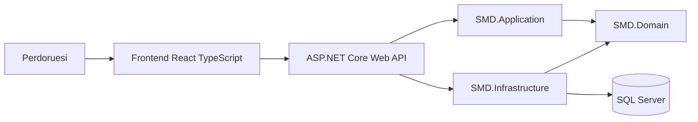
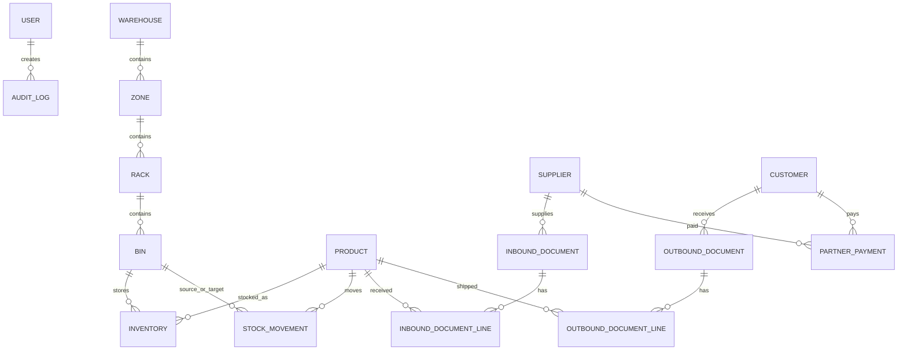
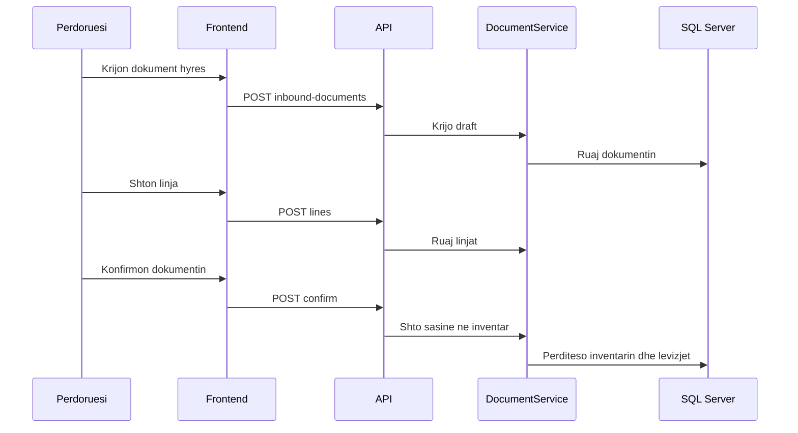
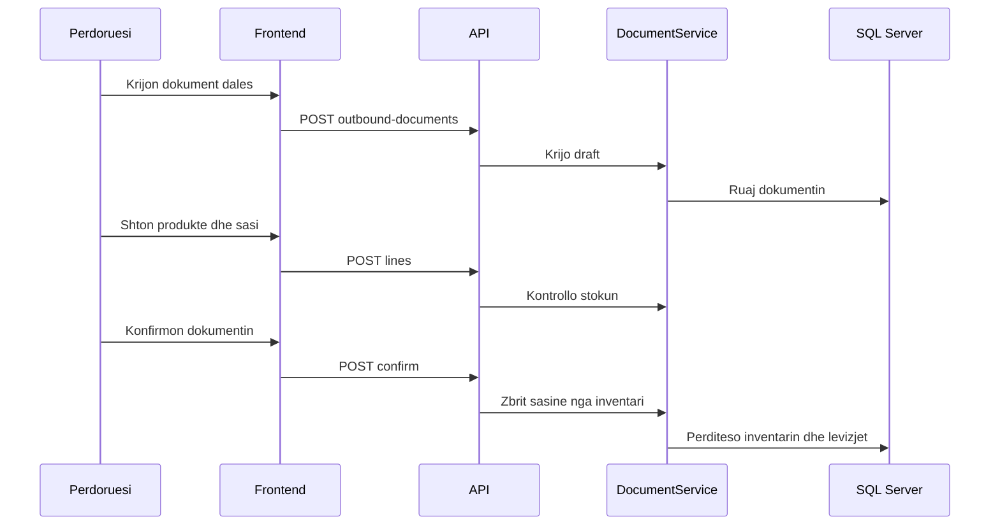

# Sistemi i Menaxhimit te Depove (SMD)

## Titulli i punimit

**Projektimi dhe implementimi i nje Sistemi per Menaxhimin e Depove me kontroll te inventarit, gjurmim dokumentesh dhe mbeshtetje per vendimmarrje operative**

Titull alternativ akademik:

**Sistemi i Menaxhimit te Depove (SMD): projektim, implementim dhe vleresim i nje platforme digjitale per kontrollin e stokut dhe proceseve logjistike**

## Te dhenat e temes

Universiteti: Universiteti Publik Kadri Zeka, Gjilan

Fakulteti: Fakulteti i Shkencave Kompjuterike

Programi: Sistemet e Kontrollit dhe Inteligjenca Artificiale

Kandidati: Liridon Alimi

Mentori: Prof. Asoc. Dr. Ragmi Mustafa

Lloji i punimit: Teze per arritjen e titullit Master i Shkencave

Tema: Sistemi per Menaxhimin e Depove (SMD)

## Deklarate e autorit

Une deklaroj se ky punim eshte rezultat i punes sime dhe se burimet e perdorura jane cituar ne menyre te rregullt. Pjeset teorike, teknike dhe praktike jane strukturuar duke u mbeshtetur ne zhvillimin real te projektit SMD dhe ne dokumentimin shoqerues te krijuar gjate fazave te implementimit.

## Abstrakti

Ky punim trajton projektimin dhe implementimin e nje sistemi per menaxhimin e depove, te quajtur SMD. Problemi kryesor qe trajtohet lidhet me veshtiresite qe shfaqen gjate menaxhimit manual ose te paorganizuar te stokut, dokumenteve, lokacioneve, partnereve dhe raporteve. Qellimi i punimit eshte krijimi i nje platforme digjitale qe mundeson kontroll me te mire te inventarit, gjurmim te hyrjeve dhe daljeve, menaxhim te produkteve, klienteve, furnizuesve dhe pagesave, si dhe mbeshtetje per vendimmarrje operative.

Per realizimin e sistemit eshte perdorur nje arkitekture me shtresa. Backend-i eshte implementuar me ASP.NET Core Web API, databaza me SQL Server dhe Entity Framework Core, ndersa frontend-i me React, TypeScript dhe Vite. Sistemi perfshin autentikim me JWT, kontroll qasjeje sipas roleve, module per depo, produkte, inventar, levizje stoku, dokumente hyrese dhe dalese, financa te partnereve, audit logs, dashboard dhe eksporte ne PDF, Excel dhe CSV.

Rezultatet tregojne se SMD arrin te integroje proceset kryesore te depos ne nje aplikacion funksional. Dokumentet hyrese shtojne stok pas konfirmimit, dokumentet dalese zbresin stokun, ndersa auditimi dhe rolet rrisin sigurine dhe gjurmueshmerine. Kontributi kryesor i punimit eshte krijimi i nje baze praktike dhe te zgjerueshme per digjitalizimin e proceseve te depos, me mundesi zhvillimi te metejshem drejt raporteve me te avancuara, integrimeve fizike me barcode scanner dhe funksionaliteteve te bazuara ne inteligjence artificiale.

## Fjalet kyce

Sistem i menaxhimit te depove, inventar, dokumente hyrese, dokumente dalese, gjurmim stoku, barcode, auditim, SQL Server, ASP.NET Core, React, Entity Framework Core.

## Permbajtja

Kapitulli 1 - Hyrje

Kapitulli 2 - Shqyrtimi i literatures dhe koncepteve teorike

Kapitulli 3 - Analiza e kerkesave

Kapitulli 4 - Projektimi i sistemit

Kapitulli 5 - Implementimi i sistemit

Kapitulli 6 - Testimi dhe validimi

Kapitulli 7 - Diskutim

Kapitulli 8 - Perfundime dhe puna e ardhshme

Bibliografia

Shtojcat

---

# Kapitulli 1 - Hyrje

## 1.1 Konteksti i problemit

Menaxhimi i depove eshte nje nga proceset me te rendesishme per organizatat qe punojne me mallra fizike, produkte, furnizime dhe shperndarje. Ne nje depo kryhen vazhdimisht procese si pranimi i mallrave, vendosja ne lokacione, levizja e brendshme e produkteve, pergatitja e daljeve, kontrolli i sasive, gjurmimi i dokumenteve dhe raportimi per gjendjen aktuale te stokut. Nese keto procese nuk menaxhohen ne menyre te strukturuar, biznesi mund te perballet me gabime operative, humbje kohe, mungese informacioni dhe vendimmarrje jo te sakte.

Ne shume raste, menaxhimi i depos realizohet ende permes regjistrave manuale, dokumenteve te shperndara, tabelave te thjeshta elektronike ose sistemeve qe nuk jane te integruara me njera-tjetren. Kjo menyre pune krijon veshtiresi ne kontrollin e sasive reale ne stok, ne gjetjen e lokacionit te produkteve, ne gjurmimin e historikut te levizjeve dhe ne lidhjen e dokumenteve operative me pagesat ose detyrimet ndaj partnereve. Si pasoje, perdoruesit mund te mos kene pasqyre te qarte per gjendjen e depos ne kohe reale.

Probleme te tilla behen edhe me te dukshme kur rritet numri i produkteve, lokacioneve, perdoruesve dhe dokumenteve qe perpunohen cdo dite. Pa nje sistem te centralizuar, rritet mundesia e dublimit te te dhenave, regjistrimit te gabuar te sasive, mungeses se historikut dhe veshtiresise per te identifikuar se kush ka kryer nje veprim te caktuar. Per kete arsye, zhvillimi i nje sistemi digjital per menaxhimin e depove paraqet nje nevoje praktike dhe organizative.

Sistemi i Menaxhimit te Depove (SMD) eshte konceptuar si nje zgjidhje per keto probleme. Ai synon te ofroje nje platforme te integruar ku proceset kryesore te depos, si produktet, inventari, dokumentet hyrese dhe dalese, levizjet e stokut, partneret, pagesat, auditimi dhe raportet, te menaxhohen ne nje vend te vetem.

## 1.2 Motivimi

Motivimi kryesor per zhvillimin e sistemit SMD lidhet me nevojen per digjitalizimin e proceseve te depos dhe permiresimin e kontrollit mbi stokun. Nje sistem i tille ndihmon qe te dhenat te mos jene te shperndara ne dokumente te ndryshme, por te ruhen ne nje databaze te centralizuar, ku mund te kontrollohen, perditesohen dhe analizohen me lehte.

Nje motivim tjeter eshte nevoja per gjurmueshmeri. Ne menaxhimin e depos nuk mjafton te dihet vetem sasia aktuale e nje produkti; eshte po aq e rendesishme te dihet si ka ardhur ajo sasi, nga cili dokument hyres eshte krijuar, ne cilin lokacion ndodhet, cilat levizje jane kryer dhe nga cili perdorues. Kjo e ben sistemin me transparent dhe me te sigurt per perdorim praktik.

SMD gjithashtu motivohet nga nevoja per ndarje rolesh dhe pergjegjesish. Jo cdo perdorues duhet te kete te njejtat te drejta ne sistem. Per shembull, nje punetor mund te kete te drejte te shtoje linja ose te kryeje veprime operative, ndersa nje menaxher ose administrator mund te kete te drejte te konfirmoje dokumente, te menaxhoje perdorues ose te shikoje audit logs. Kjo ndarje ndihmon ne rritjen e sigurise dhe kontrollit.

Nje aspekt tjeter i rendesishem eshte raportimi. Sistemi duhet te ofroje informacione te shpejta per gjendjen e inventarit, dokumentet, levizjet e stokut dhe detyrimet financiare ndaj partnereve. Keto informacione ndihmojne menaxhmentin te marre vendime me te informuara dhe me te shpejta.

## 1.3 Qellimi i punimit

Qellimi kryesor i ketij punimi eshte projektimi dhe implementimi i nje sistemi per menaxhimin e depove, i cili mundeson kontrollin e inventarit, dokumentimin e hyrjeve dhe daljeve, gjurmimin e levizjeve te stokut, menaxhimin e produkteve, partnereve dhe pagesave, si dhe gjenerimin e raporteve operative.

Punimi synon te paraqese jo vetem aspektin teorik te menaxhimit te depove, por edhe nje implementim praktik te nje sistemi funksional. Per kete arsye, fokusi eshte vendosur ne zhvillimin e nje aplikacioni te plote me backend, frontend dhe databaze, ku perdoruesit mund te kryejne veprime reale si krijimi i produkteve, pranimi i mallrave, dalja e mallrave, transferimi i stokut, regjistrimi i pagesave dhe shikimi i raporteve.

Qellimi tjeter i punimit eshte te tregoje se si teknologjite moderne te zhvillimit te softuerit, si ASP.NET Core, Entity Framework Core, SQL Server, React dhe TypeScript, mund te perdoren per te ndertuar nje sistem te strukturuar, te zgjerueshem dhe te pershtatshem per procese operative te depos.

## 1.4 Objektivat e punimit

Per te arritur qellimin kryesor, punimi ka keto objektiva:

- te analizoje kerkesat funksionale dhe jofunksionale te nje sistemi per menaxhimin e depove;
- te projektoje arkitekturen e sistemit SMD duke ndare qarte shtresen e API-se, logjikes se aplikacionit, domenit, infrastruktures dhe frontend-it;
- te modeloje databazen dhe entitetet kryesore qe perfaqesojne proceset e depos;
- te implementoje backend API-ne per menaxhimin e perdoruesve, produkteve, lokacioneve, inventarit, dokumenteve, partnereve, pagesave dhe raporteve;
- te implementoje frontend-in qe i mundeson perdoruesit te nderveproje me sistemin ne menyre te qarte dhe te organizuar;
- te integroje autentikimin me JWT dhe kontrollin e qasjes sipas roleve;
- te implementoje mekanizma per gjurmueshmeri, auditim dhe kontroll te veprimeve kritike;
- te mundesoje eksportimin e te dhenave ne formate te ndryshme si PDF, Excel dhe CSV;
- te validoje funksionalitetet kryesore te sistemit permes skenareve praktike te testimit;
- te identifikoje kufizimet aktuale dhe mundesite per zhvillim te metejshem.

## 1.5 Pyetjet kerkimore

Punimi udhehiqet nga disa pyetje kerkimore qe lidhen me projektimin, implementimin dhe vleresimin e sistemit:

- Si mund te projektohet nje sistem i integruar per menaxhimin e proceseve te depos?
- Cilat jane entitetet dhe proceset kryesore qe duhet te mbeshtese nje sistem depoje?
- Si mund te sigurohet gjurmueshmeria e hyrjeve, daljeve dhe levizjeve te stokut?
- Si ndikon ndarja e roleve ne sigurine dhe kontrollin e sistemit?
- Si mund te ndihmojne raportet dhe dashboard-i ne vendimmarrjen operative?
- Si mund te integrohen dokumentet operative me inventarin dhe financat e partnereve?
- Cilat jane mundesite per zgjerimin e sistemit ne te ardhmen me analitike ose inteligjence artificiale?

## 1.6 Metodologjia

Metodologjia e perdorur ne kete punim eshte e orientuar drejt projektimit dhe implementimit praktik te nje sistemi softuerik. Fillimisht eshte analizuar problemi i menaxhimit te depove dhe jane identifikuar proceset kryesore qe duhet te mbeshtese sistemi. Pas kesaj jane percaktuar kerkesat funksionale dhe jofunksionale, duke u bazuar ne rrjedhat tipike te punes ne nje depo.

Ne fazen e projektimit eshte percaktuar arkitektura e sistemit, ku aplikacioni eshte ndare ne shtresa te vecanta: API, application layer, domain layer, infrastructure layer dhe frontend. Kjo ndarje eshte zgjedhur per te rritur qartesine e kodit, mirembajtjen dhe mundesine per zgjerim ne te ardhmen.

Me pas eshte modeluar databaza duke perdorur Entity Framework Core dhe SQL Server. Jane percaktuar entitetet kryesore si perdoruesit, depot, lokacionet, produktet, inventari, levizjet e stokut, dokumentet hyrese dhe dalese, klientet, furnizuesit, pagesat dhe audit logs.

Implementimi eshte realizuar ne menyre iteruese, duke zhvilluar gradualisht modulet kryesore te sistemit. Fillimisht jane implementuar autentikimi dhe struktura baze, pastaj modulet per depo, produkte dhe inventar, dhe me pas dokumentet, financat, auditimi, dashboard-i dhe eksportet. Frontend-i eshte zhvilluar paralelisht per te mundesuar perdorimin praktik te funksionaliteteve te backend-it.

Ne fazen e validimit jane testuar rrjedhat kryesore te sistemit, si hyrja ne sistem, krijimi i produkteve, pranimi i mallrave, dalja e mallrave, levizjet e stokut, regjistrimi i pagesave dhe eksportimi i raporteve. Rezultatet e testimit dhe kufizimet e sistemit trajtohen ne kapitujt e meposhtem.

## 1.7 Struktura e punimit

Ky punim eshte organizuar ne disa kapituj qe ndjekin rrjedhen logjike nga analiza e problemit deri te implementimi dhe vleresimi i sistemit.

Kapitulli i pare paraqet hyrjen, kontekstin e problemit, motivimin, qellimin, objektivat, pyetjet kerkimore dhe metodologjine e perdorur. Kapitulli i dyte trajton bazen teorike dhe rishikimin e literatures, duke perfshire konceptet kryesore te menaxhimit te depove, inventarit, dokumenteve, metodave FIFO/FEFO, barcode-it, sigurise dhe raporteve.

Kapitulli i trete paraqet analizen e kerkesave, aktoret e sistemit, kerkesat funksionale dhe jofunksionale, rregullat e biznesit dhe use cases kryesore. Kapitulli i katert fokusohet ne projektimin e sistemit, duke perfshire arkitekturen, backend-in, frontend-in, databazen, sigurine dhe raportet.

Kapitulli i peste pershkruan implementimin e sistemit SMD dhe modulet kryesore te zhvilluara. Kapitulli i gjashte trajton testimin dhe validimin e funksionaliteteve. Kapitulli i shtate paraqet rezultatet dhe diskutimin, ndersa kapitulli i tete perfshin perfundimet dhe punen e ardhshme.

---

# Kapitulli 2 - Baza teorike dhe rishikimi i literatures

## 2.1 Sistemet e menaxhimit te depove

Sistemet e menaxhimit te depove, te njohura shpesh si Warehouse Management Systems (WMS), jane sisteme softuerike qe ndihmojne ne organizimin, kontrollin dhe gjurmimin e proceseve qe ndodhin brenda nje depoje. Keto sisteme perdoren per te menaxhuar pranimin e mallrave, vendosjen e tyre ne lokacione, levizjet e brendshme, pergatitjen e daljeve, kontrollin e inventarit dhe raportimin operacional. Ne thelb, nje sistem i tille synon te siguroje qe produkti i duhur te ndodhet ne vendin e duhur, ne sasine e duhur dhe ne kohen e duhur.

Ne nje mjedis tradicional, proceset e depos mund te realizohen permes dokumenteve fizike, regjistrave manuale ose tabelave elektronike. Megjithate, me rritjen e numrit te produkteve, porosive, lokacioneve dhe perdoruesve, keto metoda behen te veshtira per t'u kontrolluar. Per kete arsye, nje WMS ofron nje menyre me te strukturuar per te ruajtur dhe perpunuar te dhenat. Ai krijon lidhje ndermjet produkteve, lokacioneve, sasive, dokumenteve dhe perdoruesve.

Funksionet kryesore te nje sistemi per menaxhimin e depove zakonisht perfshijne pranimin e mallrave, ruajtjen ne lokacione, levizjet e brendshme, pergatitjen e daljeve, kontrollin e sasive, gjurmimin e loteve ose serive, si dhe gjenerimin e raporteve. Dokumentacioni i Oracle per proceset e inventarit dhe magazinimit tregon rendesine e hapave si rezervimi, picking dhe konfirmimi i dergesave ne kontrollin e levizjes se materialeve nga depoja deri te klienti (Oracle, n.d.).

Ne rastin e SMD, koncepti i WMS eshte aplikuar duke ndertuar module per depot, zonat, raftet, bin-at, produktet, inventarin, dokumentet hyrese, dokumentet dalese dhe levizjet e stokut. Kjo e ben sistemin te pershtatshem per menaxhimin e proceseve baze te nje depoje ne menyre te centralizuar.

## 2.2 Menaxhimi i inventarit

Menaxhimi i inventarit eshte nje pjese thelbesore e zinxhirit te furnizimit. Sipas IBM, menaxhimi i inventarit lidhet me gjurmimin e stokut nga prodhuesit drejt depove dhe me pas drejt pikes se shitjes, me synimin qe produktet e duhura te jene ne vendin e duhur dhe ne kohen e duhur (IBM, n.d.). Kjo e ben inventarin jo vetem nje liste produktesh, por nje pasqyre dinamike te gjendjes operative te biznesit.

Ne nje sistem depoje, inventari duhet te tregoje sasine aktuale te nje produkti, sasine e rezervuar, sasine e disponueshme, lokacionin ku ndodhet produkti dhe historikun e ndryshimeve. Keto te dhena jane te rendesishme per te shmangur mungesat ne stok, mbistokimin, gabimet ne dalje dhe vonesat ne permbushjen e kerkesave te klienteve.

Konceptet kryesore qe lidhen me inventarin jane:

- sasia ne gjendje, qe perfaqeson sasine fizike te produktit ne depo;
- sasia e rezervuar, qe perfaqeson sasine e bllokuar per nje dokument ose proces te caktuar;
- sasia e disponueshme, qe zakonisht llogaritet si diference ndermjet sasise ne gjendje dhe sasise se rezervuar;
- minimum stock level, qe ndihmon ne identifikimin e produkteve qe duhet te rimbushen;
- levizjet IN, OUT, TRANSFER dhe ADJUST, qe tregojne menyren si ndryshon stoku;
- lot number, batch number dhe expiry date, qe ndihmojne ne gjurmueshmerine e produkteve.

Ne SMD, menaxhimi i inventarit eshte realizuar duke ruajtur lidhjen ndermjet produktit, bin-it, sasise, rezervimit, lot-it, batch-it dhe dates se skadences. Kjo i jep sistemit mundesi te kontrolloje stokun jo vetem ne nivel produkti, por edhe ne nivel lokacioni dhe grupi prodhimi.

## 2.3 Dokumentet hyrese dhe dalese

Dokumentet operative jane pjese e rendesishme e menaxhimit te depos, sepse ato perfaqesojne bazen formale per hyrjen dhe daljen e mallrave. Dokumenti hyres perdoret kur mallrat pranohen ne depo, ndersa dokumenti dales perdoret kur mallrat largohen nga depoja per shitje, dergese ose konsum te brendshem.

Nje dokument hyres zakonisht permban furnizuesin, daten, referencen, produktet e pranuara, sasite, lokacionet ku vendosen produktet dhe informacione shtese si lot number, batch number ose expiry date. Kur dokumenti hyres konfirmohet, sistemi duhet te rrise sasine e inventarit ne lokacionet perkatese.

Nje dokument dales zakonisht permban klientin, produktet qe do te dalin, sasite, lokacionet nga ku merret stoku dhe cmimet perkatese. Kur dokumenti dales konfirmohet, sistemi duhet te zbrese sasine nga inventari. Ky proces duhet te kontrolloje nese ka stok te mjaftueshem dhe nese produktet jane te disponueshme.

Statuset e dokumenteve jane te rendesishme per kontrollin e rrjedhes se punes. Nje dokument mund te jete ne gjendje draft, i konfirmuar ose i anuluar. Gjendja draft lejon plotesimin dhe korrigjimin e dokumentit, ndersa konfirmimi e ben dokumentin pjese te historikut zyrtar te inventarit. Anulimi perdoret kur dokumenti nuk duhet te vazhdoje me efekt ne stok.

Ne SMD, dokumentet hyrese dhe dalese jane lidhur drejtpersedrejti me inventarin. Kjo do te thote se dokumenti nuk eshte thjesht regjistrim administrativ, por veprim qe ndikon ne gjendjen reale te stokut.

## 2.4 Metodat FIFO dhe FEFO

Metodat FIFO dhe FEFO jane metoda te perdorura per te percaktuar rendin me te cilin duhet te dalin produktet nga depoja. Keto metoda jane vecanerisht te rendesishme kur ka shume hyrje te te njejtit produkt ne kohe te ndryshme, me lote te ndryshme ose me data skadence te ndryshme.

FIFO, ose First In, First Out, nenkupton qe produktet qe kane hyre me heret ne depo duhet te dalin te parat. Kjo metode eshte e pershtatshme per shume produkte standarde, sepse ndihmon ne shmangien e qendrimit te gjate te stokut ne depo.

FEFO, ose First Expired, First Out, nenkupton qe produktet me daten me te afert te skadences duhet te dalin te parat, pavaresisht se kur kane hyre ne depo. Kjo metode eshte shume e rendesishme per produkte qe kane afat perdorimi, si ushqime, produkte farmaceutike, kozmetike ose materiale te ndjeshme ndaj kohes. Dokumentacioni i SAP per strategjite FEFO ne warehouse management e lidh FEFO me daten e skadences dhe batch management, duke treguar rendesine e kesaj qasjeje ne proceset e daljes se stokut (SAP, n.d.).

Per SMD, FEFO eshte koncept i rendesishem sepse sistemi mbeshtet expiry date ne inventar dhe ne linjat e dokumenteve dalese. Kjo krijon bazen per nje logjike ku produktet mund te zgjidhen sipas dates se skadences dhe jo vetem sipas radhes se hyrjes.

## 2.5 Barcode dhe gjurmueshmeria

Barcode eshte nje nga teknologjite me te perdorura per identifikimin automatik te produkteve dhe objekteve ne zinxhirin e furnizimit. Sipas GS1, barcode-et jane simbole qe mund te skanohen ne menyre elektronike dhe perdoren per te koduar identifikues te ndryshem, si produkti, dergesa, lokacioni, numri serial, lot-i, batch-i ose data (GS1, n.d.).

Perdorimi i barcode-it ndihmon ne uljen e gabimeve gjate regjistrimit manual te te dhenave. Ne vend qe perdoruesi te shkruaje kodin e produktit, ai mund te skanoje barcode-in dhe sistemi te identifikoje produktin automatikisht. Kjo eshte vecanerisht e rendesishme ne depo, ku shpejtesia dhe saktesia jane thelbesore.

Gjurmueshmeria lidhet me aftesine per te ndjekur historikun e nje produkti ose veprimi ne sistem. Nje sistem i mire depoje duhet te tregoje kur ka hyre nje produkt, ku eshte vendosur, nga cili dokument ka ardhur, ne cilat levizje eshte perfshire dhe kur ka dale nga depoja. Barcode-i ndihmon ne kete proces duke ofruar identifikim te shpejte dhe te sakte.

Ne SMD eshte perfshire mbeshtetje per barcode te produkteve dhe gjenerim te barcode labels ne PDF. Kjo e ben sistemin me te afert me praktikat reale te punes ne depo.

## 2.6 Siguria, autentikimi dhe autorizimi

Siguria eshte nje komponent i domosdoshem ne sistemet qe menaxhojne te dhena operative dhe financiare. Ne nje sistem depoje, perdoruesit mund te kryejne veprime qe ndikojne ne stok, dokumente, pagesa dhe raporte. Per kete arsye, sistemi duhet te kontrolloje kush eshte perdoruesi, cfare roli ka dhe cilat veprime ka te drejte te kryeje.

Autentikimi eshte procesi i verifikimit te identitetit te perdoruesit. Ne aplikacionet moderne web, nje nga qasjet e zakonshme eshte perdorimi i token-eve. Microsoft Learn shpjegon se JWT bearer authentication perdoret shpesh per API, ku klienti dergon token-in ne header-in `Authorization` per te provuar identitetin dhe per te fituar qasje ne burimet e mbrojtura (Microsoft, n.d.).

Autorizimi eshte procesi qe percakton nese nje perdorues i autentikuar ka te drejte te kryeje nje veprim te caktuar. Ne ASP.NET Core, role-based authorization mundeson kufizimin e qasjes ne controller-a ose action-a sipas roleve te perdoruesve. Dokumentacioni i Microsoft tregon se qasja mund te kufizohet per role te caktuara, si p.sh. administrator, menaxher ose perdorues tjeter me te drejta specifike (Microsoft, n.d.).

Ne SMD jane perdorur role si Admin, Worker, Supervisor dhe Manager. Keto role ndihmojne ne ndarjen e pergjegjesive. Per shembull, jo cdo perdorues duhet te kete te drejte te menaxhoje perdorues, te shikoje audit logs ose te konfirmoje dokumente.

Audit logs jane gjithashtu pjese e sigurise dhe kontrollit. Ato ruajne informacione per veprimet qe kryhen ne sistem, si veprimi, entiteti, perdoruesi, koha dhe detajet e ndryshimit. Kjo ndihmon ne transparence, gjurmueshmeri dhe analizim te gabimeve ose veprimeve te dyshimta.

## 2.7 Roli i raporteve dhe dashboard-eve

Raportet dhe dashboard-et jane mjete te rendesishme per vendimmarrjen operative dhe menaxheriale. Nje sistem mund te mbledhe shume te dhena, por vlera e tyre rritet kur ato paraqiten ne menyre te kuptueshme dhe te perdorshme per vendimmarrje. Ne kontekstin e depos, raportet mund te tregojne gjendjen e inventarit, produktet me stok te ulet, levizjet e fundit, dokumentet e papaguara, produktet me afat skadence dhe historikun e veprimeve.

Dashboard-i ofron nje pasqyre te shpejte te gjendjes se sistemit. Ai nuk zevendeson raportet e detajuara, por ndihmon perdoruesin te kuptoje shpejt se cilat fusha kerkojne vemendje. Per shembull, nje dashboard mund te tregoje numrin e dokumenteve draft, produktet nen minimum stock level, levizjet e fundit te stokut ose detyrimet financiare.

Raportet ne formate si PDF, Excel dhe CSV jane te rendesishme sepse mund te perdoren per arkivim, ndarje me pale te tjera, analiza te metejshme ose dokumentim zyrtar. Ne SMD jane implementuar eksportime per dokumente, inventar, stock movements dhe dokumente te papaguara. Kjo e zgjeron sistemin nga nje aplikacion operacional ne nje mjet raportimi dhe kontrolli.

## 2.8 Mundesite e inteligjences artificiale ne menaxhimin e depove

Inteligjenca artificiale mund te luaje rol te rendesishem ne zhvillimin e metejshem te sistemeve per menaxhimin e depove. Edhe pse SMD ne gjendjen aktuale fokusohet ne menaxhimin operacional, arkitektura dhe te dhenat qe sistemi mbledh mund te sherbejne si baze per funksionalitete me te avancuara analitike.

Nje mundesi eshte parashikimi i kerkeses per produkte. Duke analizuar levizjet historike te stokut dhe dokumentet dalese, sistemi mund te sugjeroje cilat produkte pritet te kerkohet me shume ne periudha te caktuara. Kjo mund te ndihmoje ne planifikimin e furnizimeve dhe shmangien e mungesave ne stok.

Nje mundesi tjeter eshte rekomandimi per rimbushje stoku. Sistemi mund te krahasoje sasine aktuale me minimum stock level, historikun e shitjeve ose daljeve dhe kohen e furnizimit, per te propozuar kur duhet te porositen produkte te reja.

Inteligjenca artificiale mund te perdoret edhe per identifikimin e anomalive. Per shembull, nese nje produkt ka levizje te pazakonta, dalje te shpeshta, korrigjime te perseritura ose ndryshime te dyshimta ne inventar, sistemi mund te sinjalizoje perdoruesit per verifikim.

Nje fushe tjeter eshte optimizimi i lokacioneve. Duke analizuar se cilat produkte levizin me shpesh, sistemi mund te sugjeroje vendosjen e tyre ne lokacione me te pershtatshme per te ulur kohen e punes se perdoruesve ne depo.

Keto mundesi nuk jane te domosdoshme per funksionimin baze te SMD, por paraqesin drejtime te rendesishme per zgjerim te ardhshem, sidomos ne kontekstin e sistemeve inteligjente dhe vendimmarrjes se automatizuar.

## 2.9 SMD si sistem kontrolli informacioni

Ne kontekstin e drejtimit "Sistemet e Kontrollit dhe Inteligjenca Artificiale", SMD mund te interpretohet edhe si nje sistem kontrolli informacioni. Depoja fizike paraqet objektin qe kontrollohet, ndersa aplikacioni SMD luan rolin e kontrollorit logjik qe pranon te dhena, i validon ato dhe prodhon veprime operative mbi inventarin. Ne kete kuptim, sistemi nuk eshte vetem nje regjister elektronik, por nje mekanizem qe e mban gjendjen e depos nen kontroll.

Cikli i kontrollit fillon me matjen ose regjistrimin e gjendjes: perdoruesi regjistron dokumente, lokacione, produkte, sasi, batch, lot dhe expiry date. Keto te dhena perfaqesojne variablat e gjendjes se sistemit. Backend-i pastaj zbaton rregulla te biznesit, si moslejimi i daljes mbi sasine e disponueshme, kontrolli i statusit Draft/Confirmed, validimi i rolit te perdoruesit dhe ruajtja e audit log-ut. Rezultati i ketij vendimi eshte ndryshimi i kontrolluar i inventarit dhe krijimi i stock movement.

Feedback-u realizohet permes dashboard-it, raporteve, audit logs dhe historikut te levizjeve. Perdoruesi mund te shoh se cfare ka ndodhur, kush e ka kryer veprimin dhe si eshte ndryshuar gjendja e stokut. Kjo qasje e ben SMD te pershtatshem per zgjerime inteligjente ne te ardhmen, ku te dhenat historike mund te perdoren per parashikim te kerkeses, identifikim anomalish dhe rekomandime per rimbushje stoku.

## 2.10 Teknologjite per zhvillimin e sistemeve web

Per zhvillimin e nje sistemi modern per menaxhimin e depove nevojiten teknologji qe mbeshtesin ndarjen e qarte te pergjegjesive, ruajtjen e te dhenave, komunikimin ndermjet klientit dhe serverit, si dhe sigurine. Ne SMD, backend-i eshte ndertuar me ASP.NET Core Web API, ndersa frontend-i me React dhe TypeScript.

Entity Framework Core eshte perdorur si Object-Relational Mapper per komunikimin me databazen. Sipas dokumentacionit te Microsoft, EF Core u mundeson zhvilluesve .NET te punojne me databazen permes objekteve .NET dhe redukton sasine e kodit te nevojshem per qasje ne te dhena (Microsoft, n.d.). Kjo qasje eshte e pershtatshme per sisteme si SMD, ku entitetet e domenit, si produktet, inventari dhe dokumentet, duhet te ruhen dhe lexohen vazhdimisht nga databaza.

Ne frontend, perdorimi i React dhe TypeScript ndihmon ne krijimin e nje nderfaqeje dinamike dhe me tipizim me te qarte. Kjo eshte e rendesishme ne nje sistem me shume faqe dhe rrjedha pune, sepse zvogelon gabimet dhe e ben kodin me te mirembajtshem.

## 2.11 Permbledhje e kapitullit

Ky kapitull paraqiti konceptet teorike qe lidhen me sistemin SMD. U trajtuan sistemet e menaxhimit te depove, menaxhimi i inventarit, dokumentet operative, metodat FIFO dhe FEFO, barcode-i, siguria, raportet, dashboard-et, interpretimi i SMD si sistem kontrolli informacioni dhe mundesite e inteligjences artificiale. Keto koncepte krijojne bazen per kapitujt vijues, ku do te analizohet se si keto ide jane perkthyer ne kerkesa, projektim dhe implementim konkret ne sistemin SMD.

Burime te perdorura ne kete kapitull:

- IBM. What is inventory management? https://www.ibm.com/think/topics/inventory-management
- Oracle. Inventory Management Cloud. https://www.oracle.com/applications/supply-chain-management/inventory-management/
- Oracle. How the Reserve, Pick, and Confirm Shipments Process Works. https://docs.oracle.com/en/cloud/saas/supply-chain-and-manufacturing/25b/faims/how-the-reserve-pick-and-confirm-shipments-process-works.html
- GS1. Barcodes - Standards. https://www.gs1.org/standards/barcodes
- SAP. FEFO stock removal strategy knowledge base preview. https://userapps.support.sap.com/sap/support/knowledge/en/3331359
- Microsoft Learn. Configure JWT bearer authentication in ASP.NET Core. https://learn.microsoft.com/en-us/aspnet/core/security/authentication/configure-jwt-bearer-authentication
- Microsoft Learn. Role-based authorization in ASP.NET Core. https://learn.microsoft.com/en-us/aspnet/core/security/authorization/roles
- Microsoft Learn. Overview of Entity Framework Core. https://learn.microsoft.com/en-us/ef/core/

---

# Kapitulli 3 - Analiza e kerkesave

## 3.1 Pershkrimi i aktoreve

Analiza e kerkesave fillon me identifikimin e aktoreve qe nderveprojne me sistemin. Ne sistemin SMD, aktoret kryesore jane perdoruesit qe kane pergjegjesi te ndryshme ne proceset e depos. Secili aktor ka nivel te ndryshem qasjeje dhe veprimesh, sipas rolit qe i caktohet ne sistem.

Aktori i pare eshte administratori. Administratori ka nivelin me te larte te qasjes ne sistem. Ai mund te menaxhoje perdoruesit, te ndryshoje rolet, te kete qasje ne audit logs dhe te kryeje veprime kritike qe lidhen me konfigurimin dhe kontrollin e sistemit. Ky rol eshte i rendesishem sepse siguron mbikeqyrje te plote mbi perdorimin e aplikacionit.

Aktori i dyte eshte menaxheri. Menaxheri ka rol mbikeqyres dhe vendimmarres ne proceset operative. Ai mund te kete qasje ne dokumente, raporte, inventar, produkte, klient, furnizues dhe te dhena financiare. Menaxheri perdor sistemin per te kontrolluar gjendjen e depos, per te analizuar informacionet dhe per te marre vendime operative.

Aktori i trete eshte mbikeqyresi. Mbikeqyresi ka pergjegjesi per kontrollin e punes operative ne depo. Ai mund te monitoroje dokumentet, levizjet e stokut dhe proceset e pranimit ose daljes se mallrave. Ky rol ndihmon ne sigurimin qe veprimet operative te kryhen sipas rregullave te percaktuara.

Aktori i katert eshte punetori. Punetori eshte perdoruesi qe kryen veprime praktike ne sistem, si regjistrimi i linjave ne dokumente, kontrolli i inventarit, perdorimi i produkteve dhe ekzekutimi i veprimeve te perditshme. Qasja e tij duhet te jete e kufizuar ne funksionalitetet qe i nevojiten per punen operative.

Pervec ketyre aktoreve, sistemi mund te konsideroje edhe aktore indirekte si klientet dhe furnizuesit. Ata nuk hyjne domosdoshmerisht ne sistem si perdorues, por te dhenat e tyre ruhen dhe perdoren ne dokumente, pagesa dhe raporte.

## 3.2 Kerkesat funksionale

Kerkesat funksionale pershkruajne veprimet qe sistemi duhet te mundesoje per perdoruesit. Ne SMD, kerkesat funksionale jane ndare sipas moduleve kryesore te sistemit.

Moduli i autentikimit duhet te mundesoje hyrjen e perdoruesve ne sistem permes kredencialeve. Pas autentikimit, sistemi duhet te gjeneroje dhe perdore token per komunikim me API-ne. Gjithashtu, sistemi duhet te identifikoje rolin e perdoruesit dhe te kufizoje qasjen ne baze te tij.

Moduli i menaxhimit te perdoruesve duhet te mundesoje regjistrimin e perdoruesve, ruajtjen e te dhenave te tyre, statusin aktiv ose joaktiv dhe ndryshimin e roleve. Ky funksionalitet duhet te jete i kufizuar per administratorin.

Moduli i strukturave te depos duhet te mundesoje menaxhimin e depove, zonave, rafteve dhe bin-ave. Sistemi duhet te ruaje lidhjet ndermjet ketyre strukturave, ne menyre qe cdo produkt ne inventar te lidhet me nje lokacion te sakte fizik.

Moduli i produkteve duhet te mundesoje krijimin, perditesimin, listimin dhe fshirjen e produkteve. Per cdo produkt duhet te ruhen te dhena si SKU, emri, barcode, njesia matese, minimum stock level dhe cmimet. Sistemi duhet te siguroje qe SKU dhe barcode te jene unike.

Moduli i inventarit duhet te paraqese gjendjen aktuale te stokut. Ai duhet te mundesoje filtrimin sipas produktit ose lokacionit, shfaqjen e sasise ne gjendje, sasise se rezervuar dhe sasise se disponueshme. Gjithashtu, sistemi duhet te mbeshtese lot number, batch number dhe expiry date.

Moduli i levizjeve te stokut duhet te mundesoje regjistrimin e hyrjeve direkte, daljeve direkte, transferimeve dhe rregullimeve te stokut. Cdo levizje duhet te ruaje produktin, sasine, tipin e levizjes, lokacionin burim ose destinacion dhe informacionet shoqeruese.

Moduli i dokumenteve hyrese duhet te mundesoje krijimin e nje dokumenti draft per pranimin e mallrave, shtimin e linjave, fshirjen ose ndryshimin e linjave, konfirmimin dhe anulimin e dokumentit. Pas konfirmimit, sistemi duhet te shtoje sasine ne inventar.

Moduli i dokumenteve dalese duhet te mundesoje krijimin e dokumenteve per dalje malli, shtimin e produkteve, zgjedhjen e cmimit sipas price tier, kontrollin e stokut te disponueshem, konfirmimin dhe anulimin e dokumentit. Pas konfirmimit, sistemi duhet te zbrese sasine nga inventari.

Moduli i klienteve dhe furnizuesve duhet te mundesoje regjistrimin, perditesimin, listimin dhe perdorimin e tyre ne dokumente. Furnizuesit lidhen kryesisht me dokumentet hyrese, ndersa klientet lidhen me dokumentet dalese.

Moduli i financave te partnereve duhet te mundesoje regjistrimin e pagesave, shikimin e balancave, lidhjen e pagesave me dokumente dhe identifikimin e dokumenteve te papaguara. Ky modul krijon lidhje ndermjet proceseve operative te depos dhe gjendjes financiare me partnere.

Moduli i auditimit duhet te ruaje veprimet e rendesishme qe kryhen ne sistem. Per cdo veprim duhet te ruhet perdoruesi, koha, entiteti, lloji i veprimit dhe detajet perkatese. Kjo ndihmon ne gjurmueshmeri dhe kontroll.

Moduli i raporteve dhe eksporteve duhet te mundesoje gjenerimin e dokumenteve dhe raporteve ne formate si PDF, Excel dhe CSV. Keto eksporte duhet te perfshijne dokumente hyrese, dokumente dalese, inventar, levizje stoku dhe dokumente te papaguara.

Moduli i dashboard-it duhet te ofroje nje permbledhje te gjendjes se sistemit. Ai duhet te ndihmoje perdoruesin te shikoje shpejt informacionet kryesore, si gjendjen e inventarit, dokumentet, levizjet dhe sinjalizimet operative.

## 3.3 Kerkesat jofunksionale

Kerkesat jofunksionale pershkruajne cilesite qe sistemi duhet te kete, pervec funksionaliteteve te drejtperdrejta. Keto kerkesa jane te rendesishme sepse ndikojne ne sigurine, perdorshmerine, mirembajtjen dhe besueshmerine e sistemit.

Siguria eshte nje kerkese themelore. Sistemi duhet te lejoje qasje vetem per perdoruesit e autentikuar dhe te kufizoje veprimet sipas roleve. Veprimet kritike, si menaxhimi i perdoruesve, shikimi i audit logs, konfirmimi i dokumenteve dhe levizjet direkte te stokut, duhet te jene te mbrojtura me politika autorizimi.

Perdorshmeria eshte gjithashtu e rendesishme. Sistemi duhet te kete nderfaqe te qarte, navigim te kuptueshem dhe forma qe ndihmojne perdoruesin te kryeje veprimet pa konfuzion. Meqenese perdoruesit mund te jene punetore depoje, mbikeqyres ose menaxhere, UI duhet te jete praktik dhe i thjeshte per perdorim ditor.

Mirembajtja lidhet me menyren si eshte organizuar kodi. Sistemi duhet te jete i ndare ne shtresa, ne menyre qe ndryshimet ne nje modul te mos prishin pjeset e tjera. Ndarja ne API, application layer, domain layer, infrastructure layer dhe frontend e ben sistemin me te lehte per zhvillim te metejshem.

Integriteti i te dhenave duhet te garantoje qe informacionet e ruajtura ne databaze te jene te sakta dhe konsistente. Kjo perfshin perdorimin e kufizimeve unike per SKU, barcode dhe numra dokumentesh, si dhe lidhje te qarta ndermjet entiteteve.

Performanca eshte e rendesishme per listime, filtra, raporte dhe veprime ne inventar. Sistemi duhet te jete ne gjendje te ktheje informacionet kryesore ne kohe te pranueshme, sidomos kur rritet numri i produkteve, dokumenteve dhe levizjeve.

Gjurmueshmeria eshte kerkese e rendesishme per nje sistem depoje. Sistemi duhet te ruaje historikun e levizjeve te stokut, dokumenteve dhe veprimeve te perdoruesve, ne menyre qe te jete e mundur te kuptohet se cfare ka ndodhur, kur ka ndodhur dhe kush e ka kryer veprimin.

Shkallezueshmeria paraqet aftesine e sistemit per t'u zgjeruar ne te ardhmen. SMD duhet te mundesoje shtimin e moduleve te reja, raporteve, integrimeve ose funksionaliteteve inteligjente pa ndryshuar plotesisht arkitekturen ekzistuese.

## 3.4 Rregullat e biznesit

Rregullat e biznesit percaktojne kushtet qe sistemi duhet te respektoje gjate kryerjes se veprimeve. Keto rregulla jane te nevojshme per te ruajtur saktesine e stokut dhe per te parandaluar veprime te gabuara.

Rregulli i pare eshte qe SKU i produktit duhet te jete unik. Ky rregull siguron qe cdo produkt te identifikohet ne menyre te qarte dhe te mos kete dy produkte me te njejtin kod. Po ashtu, barcode duhet te jete unik kur perdoret, sepse ai sherben per identifikim automatik te produktit.

Cdo dokument duhet te kete numer unik. Numrat e dokumenteve jane te rendesishem per gjurmueshmeri, arkivim dhe raportim. Sistemi duhet te siguroje qe dokumentet hyrese dhe dalese te mos kene numer te dubluar.

Dokumenti hyres duhet te shtoje stok vetem kur konfirmohet. Gjate fazes draft, dokumenti nuk duhet te ndryshoje inventarin real. Vetem pas konfirmimit, sasite e linjave te dokumentit duhet te shtohen ne lokacionet perkatese.

Dokumenti dales duhet te zbrese stok vetem kur konfirmohet. Para konfirmimit, sistemi duhet te kontrolloje nese ka sasi te mjaftueshme ne inventar. Sasia dalese nuk duhet te kaloje sasine e disponueshme.

Dokumentet e konfirmuara nuk duhet te ndryshohen pa rregulla te qarta. Kjo eshte e rendesishme sepse dokumenti i konfirmuar ka ndikim ne historikun e inventarit. Nese ne te ardhmen lejohet korrigjimi, ai duhet te behet permes dokumenteve korrigjuese ose veprimeve te audituara.

Levizjet direkte te stokut duhet te jene te kufizuara sipas roleve. Keto veprime ndikojne drejtperdrejt ne inventar, prandaj duhet te kryhen vetem nga perdorues te autorizuar.

Pagesat duhet te lidhen me partneret dhe, kur eshte e mundur, me dokumentet perkatese. Kjo rregull siguron qe balancat e klienteve dhe furnizuesve te jene te kuptueshme dhe te gjurmueshme.

Auditimi duhet te ruaje veprimet e rendesishme. Perdoruesi, koha, veprimi dhe entiteti duhet te ruhen per te mundesuar kontroll dhe analizim te mevonshem.

## 3.5 Use cases

Use cases pershkruajne skenaret kryesore te nderveprimit ndermjet aktoreve dhe sistemit. Ne vijim paraqiten disa nga rastet kryesore te perdorimit per sistemin SMD.

Use case i pare eshte hyrja ne sistem. Perdoruesi vendos kredencialet, sistemi i verifikon ato dhe, nese jane te sakta, i lejon qasje ne aplikacion. Pas hyrjes, sistemi identifikon rolin e perdoruesit dhe i shfaq funksionalitetet qe ai ka te drejte te perdore.

Use case i dyte eshte krijimi i produktit. Perdoruesi i autorizuar hap faqen e produkteve, vendos te dhenat e produktit si SKU, emer, barcode, njesi matese, minimum stock level dhe cmime. Sistemi kontrollon nese SKU ose barcode ekzistojne dhe, nese te dhenat jane valide, e ruan produktin.

Use case i trete eshte krijimi i dokumentit hyres. Perdoruesi krijon nje dokument draft, zgjedh furnizuesin dhe shton linjat me produktet, sasite dhe lokacionet ku do te vendosen. Dokumenti qendron ne gjendje draft deri ne momentin e konfirmimit.

Use case i katert eshte konfirmimi i dokumentit hyres. Perdoruesi i autorizuar konfirmon dokumentin. Sistemi kontrollon linjat e dokumentit dhe shton sasite ne inventar. Pas konfirmimit, dokumenti ruhet si pjese e historikut te hyrjeve.

Use case i peste eshte krijimi i dokumentit dales. Perdoruesi krijon nje dokument draft, zgjedh klientin, produktet, sasite, lokacionet dhe price tier. Sistemi duhet te ndihmoje ne zgjedhjen e stokut te disponueshem dhe te pergatise dokumentin per konfirmim.

Use case i gjashte eshte konfirmimi i dokumentit dales. Sistemi kontrollon stokun e disponueshem per linjat e dokumentit. Nese sasia eshte e mjaftueshme, dokumenti konfirmohet dhe stoku zbritet nga inventari. Nese nuk ka sasi te mjaftueshme, sistemi duhet te refuzoje konfirmimin ose te ktheje mesazh gabimi.

Use case i shtate eshte transferimi i stokut. Perdoruesi i autorizuar zgjedh produktin, sasine, lokacionin burim dhe lokacionin destinacion. Sistemi kontrollon disponueshmerine e stokut dhe regjistron levizjen duke perditesuar inventarin.

Use case i tete eshte regjistrimi i pageses. Perdoruesi zgjedh partnerin, vendos shumen, daten, referencen dhe dokumentin perkates nese ekziston. Sistemi ruan pagesen dhe e perfshin ate ne llogaritjen e balances.

Use case i nente eshte shikimi i audit logs. Administratori hap faqen e auditimit dhe filtron veprimet sipas dates, perdoruesit, entitetit ose llojit te veprimit. Sistemi shfaq historikun e veprimeve te regjistruara.

Use case i dhjete eshte eksportimi i raporteve. Perdoruesi i autorizuar zgjedh raportin ose dokumentin qe deshiron te eksportoje. Sistemi gjeneron file ne formatin perkates, si PDF, Excel ose CSV, dhe e ben te disponueshem per shkarkim.

## 3.6 Prioritetizimi i kerkesave

Jo te gjitha kerkesat kane te njejten rendesi ne fazen fillestare te zhvillimit. Per SMD, prioriteti kryesor ka qene ndertimi i funksionaliteteve qe ndikojne direkt ne menaxhimin e stokut: produktet, lokacionet, inventari, dokumentet hyrese, dokumentet dalese dhe levizjet e stokut. Keto module perbejne bazen operative te sistemit.

Prioriteti i dyte ka perfshire funksionalitete mbeshtetese si klientet, furnizuesit, pagesat, raportet, eksportet dhe dashboard-i. Keto module e zgjerojne sistemin dhe e bejne me te dobishem per menaxhim dhe vendimmarrje.

Prioriteti i trete lidhet me zgjerimet e ardhshme, si analitika e avancuar, njoftimet automatike, optimizimi i lokacioneve dhe perdorimi i inteligjences artificiale per parashikim ose rekomandime.

## 3.7 Permbledhje e kapitullit

Ky kapitull paraqiti analizen e kerkesave per sistemin SMD. U identifikuan aktoret kryesore, kerkesat funksionale dhe jofunksionale, rregullat e biznesit dhe use cases kryesore. Analiza e kerkesave sherben si baze per projektimin e sistemit, sepse percakton cfare duhet te beje sistemi dhe cilat kufizime duhet te respektoje gjate implementimit.

---

# Kapitulli 4 - Projektimi i sistemit

## 4.1 Arkitektura e pergjithshme

Projektimi i sistemit SMD eshte bazuar ne nje arkitekture me shtresa. Kjo qasje eshte zgjedhur per te ndare qarte pergjegjesite e sistemit dhe per ta bere aplikacionin me te lehte per mirembajtje, testim dhe zgjerim. Sistemi nuk eshte ndertuar si nje aplikacion i vetem monolitik ku e gjithe logjika eshte e perzier, por eshte ndare ne disa projekte dhe shtresa funksionale.

Ne nivelin me te larte ndodhet frontend-i, i cili eshte aplikacioni me te cilin ndervepron perdoruesi. Frontend-i komunikon me backend-in permes HTTP requests. Backend-i eshte i ndertuar si ASP.NET Core Web API dhe eshte pergjegjes per ekspozimin e endpoint-eve, kontrollin e sigurise, thirrjen e sherbimeve dhe kthimin e pergjigjeve per frontend-in.

Shtresa `SMD.Application` permban kontrata, DTO, komanda, query dhe interface te sherbimeve. Kjo shtrese ndihmon qe komunikimi ndermjet API-se dhe logjikes se biznesit te jete me i strukturuar. Shtresa `SMD.Domain` permban entitetet kryesore te biznesit, si produktet, inventari, dokumentet, perdoruesit, partneret dhe levizjet e stokut. Shtresa `SMD.Infrastructure` permban implementimin e qasjes ne databaze, migrimet, sherbimet konkrete dhe logjiken qe lidhet me Entity Framework Core.

Databaza eshte komponenti ku ruhen te dhenat e sistemit. Ne SMD eshte perdorur SQL Server, ndersa lidhja me databazen realizohet permes Entity Framework Core. Kjo ben te mundur qe entitetet e domenit te ruhen dhe lexohen ne menyre te strukturuar.

Diagrami i meposhtem paraqet arkitekturen e pergjithshme te sistemit:

Kjo arkitekture krijon nje ndarje te qarte ndermjet nderfaqes se perdoruesit, API-se, logjikes se biznesit dhe ruajtjes se te dhenave.

## 4.2 Projektimi i backend-it

Backend-i i SMD eshte projektuar si Web API. Roli kryesor i backend-it eshte te pranoje kerkesat nga frontend-i, te validoje dhe kontrolloje qasjen, te therrase sherbimet perkatese dhe te ktheje rezultatet ne format te kuptueshem per klientin.

Controller-at jane pika hyrje per funksionalitetet kryesore te sistemit. Ata jane organizuar sipas moduleve, si autentikimi, produktet, inventari, dokumentet hyrese, dokumentet dalese, klientet, furnizuesit, financat, audit logs, dashboard-i dhe raportet. Kjo ndarje e ben API-ne me te qarte dhe me te lehte per t'u kuptuar.

Sherbimet permbajne logjiken kryesore te aplikacionit. Per shembull, sherbimi i dokumenteve merret me krijimin, konfirmimin dhe anulimin e dokumenteve; sherbimi i auditimit regjistron veprimet; sherbimi i dashboard-it permbledh te dhena; ndersa sherbimi i eksporteve gjeneron dokumente ne formate te ndryshme.

Kontratat, komandat dhe pergjigjet jane vendosur ne shtresen `SMD.Application`. Kjo ndihmon ne standardizimin e komunikimit ndermjet controller-ave dhe sherbimeve. Per shembull, krijimi i nje dokumenti hyres ose shtimi i nje linje ne dokument realizohet permes komandave te percaktuara, ndersa pergjigjet kthehen permes modeleve te qarta.

Entity Framework Core perdoret per qasjen ne databaze. `SmdDbContext` perfaqeson kontekstin kryesor te databazes dhe permban `DbSet` per entitetet kryesore te sistemit. Migrimet perdoren per te evoluar strukturen e databazes ne menyre te kontrolluar.

Backend-i gjithashtu permban konfigurime per autentikim, autorizim, Swagger dhe CORS. Autentikimi realizohet me JWT, ndersa autorizimi eshte i ndare ne politika si `CanConfirmDocuments`, `CanEditMasterData`, `CanMoveStockDirectly`, `CanExport`, `CanViewAuditLogs`, `CanEditDocuments` dhe `CanManageUsers`. Keto politika ndihmojne qe veprimet kritike te jene te kufizuara sipas roleve.

## 4.3 Projektimi i frontend-it

Frontend-i i SMD eshte projektuar si aplikacion web modern me React, TypeScript dhe Vite. Qellimi i frontend-it eshte te ofroje nje nderfaqe te qarte per perdoruesin, ku ai mund te kryeje proceset operative te depos pa pasur nevoje te nderveproje direkt me databazen ose API-ne.

Navigimi ne frontend realizohet permes React Router. Sistemi ka faqe te ndara per login, dashboard, krijim dokumenti, pranime, dalje, inventar, levizje stoku, produkte, kliente, furnizues, financa dhe audit logs. Kjo ndarje ndihmon qe secili modul te kete hapesiren e vet funksionale.

Layout-i kryesor i aplikacionit permban sidebar me navigim, informacion per perdoruesin aktiv, logout dhe ndryshim teme dark/light. Kjo e ben aplikacionin me te pershtatshem per perdorim te perditshem, sepse perdoruesi mund te kaloje shpejt nga nje modul ne tjetrin.

Qasja ne faqe kontrollohet permes `RequireAuth` dhe `RequireRole`. `RequireAuth` siguron qe vetem perdoruesit e autentikuar te hyjne ne aplikacion, ndersa `RequireRole` kufizon faqe te caktuara sipas rolit te perdoruesit. Per shembull, faqja e audit logs eshte e kufizuar per role te autorizuara.

Komunikimi me backend-in eshte organizuar permes services. Secili modul ka service-in e vet, si `auth`, `products`, `inventory`, `inbound`, `outbound`, `partners`, `finance`, `audit` dhe `dashboard`. Kjo ndarje e ben kodin me te organizuar dhe e shmang perzierjen e logjikes se API-se me komponentet vizuale.

Frontend-i perdor gjithashtu tipe TypeScript per te pershkruar strukturen e te dhenave qe vijne nga API-ja. Kjo ndihmon ne zvogelimin e gabimeve dhe ne rritjen e qartesise gjate zhvillimit.

## 4.4 Projektimi i databazes

Databaza e SMD eshte projektuar per te mbeshtetur proceset kryesore te menaxhimit te depos. Modeli i databazes eshte i bazuar ne entitetet e domenit dhe lidhjet ndermjet tyre.

Perdoruesit ruhen ne tabelen e perdoruesve dhe lidhen me rolin e tyre. Ky informacion perdoret per autentikim, autorizim dhe auditim. Struktura fizike e depos modelohet permes depove, zonave, rafteve dhe bin-ave. Nje depo mund te kete disa zona, nje zone mund te kete disa rafte dhe nje raft mund te kete disa bin-a.

Produktet jane entitete te pavarura qe permbajne informacione si SKU, emer, barcode, njesi matese, minimum stock level dhe cmime. Inventari lidhet me produktin dhe bin-in, duke treguar se sa sasi e nje produkti ndodhet ne nje lokacion te caktuar. Per te mbeshtetur gjurmueshmerine, inventari permban edhe lot number, batch number dhe expiry date.

Levizjet e stokut ruhen ne tabelen e stock movements. Ato tregojne historikun e hyrjeve, daljeve, transferimeve dhe rregullimeve. Cdo levizje lidhet me produktin dhe me lokacionet burim ose destinacion, sipas tipit te levizjes.

Dokumentet hyrese dhe dalese jane projektuar me strukture header-line. Dokumenti hyres permban informacionin kryesor te pranimit dhe ka disa linja me produkte. Dokumenti dales funksionon ne menyre te ngjashme, por lidhet me daljen e mallrave dhe klientin. Kjo strukture e ben te mundur qe nje dokument te kete disa produkte dhe secila linje te kete sasi, lokacion dhe te dhena shtese.

Klientet dhe furnizuesit ruhen si partnere te sistemit. Furnizuesit lidhen me dokumentet hyrese, ndersa klientet lidhen me dokumentet dalese. Pagesat lidhen me partneret dhe, kur eshte e nevojshme, edhe me dokumentet perkatese.

Audit logs ruajne historikun e veprimeve te rendesishme. Ky entitet eshte i rendesishem per gjurmueshmeri dhe kontroll.

Diagrami i meposhtem paraqet nje ERD te thjeshtuar te lidhjeve kryesore:

Ky model eshte i zgjerueshem, sepse lejon shtimin e fushave, raporteve dhe lidhjeve te reja pa ndryshuar strukturen baze te sistemit.

## 4.5 Projektimi i sigurise

Siguria e sistemit eshte projektuar duke u bazuar ne autentikim dhe autorizim. Autentikimi realizohet permes JWT token. Kur perdoruesi hyn ne sistem me kredenciale valide, backend-i gjeneron token, ndersa frontend-i e perdor ate token per kerkesat e mevonshme drejt API-se.

Autorizimi eshte i bazuar ne role dhe politika. Rolet kryesore jane Admin, Worker, Supervisor dhe Manager. Secili rol ka te drejta te ndryshme ne sistem. Per shembull, administratori ka qasje ne menaxhimin e perdoruesve dhe audit logs, ndersa punetori ka qasje me te kufizuar ne proceset operative.

Politikat e autorizimit jane perdorur per te kontrolluar veprimet kritike. Konfirmimi i dokumenteve, editimi i master data, levizjet direkte te stokut, eksportet, shikimi i audit logs dhe menaxhimi i perdoruesve jane veprime qe duhet te kalojne kontrollin e qasjes.

Ne frontend, qasja kontrollohet permes ruajtjes se token-it dhe leximit te rolit te perdoruesit nga session-i. Faqet e mbrojtura nuk shfaqen ose nuk hapen per perdorues qe nuk kane qasje. Kjo krijon nje shtrese shtese kontrolli ne nivel UI, ndersa kontrolli kryesor mbetet ne backend.

Audit logs jane pjese e projektimit te sigurise. Ato ndihmojne ne ruajtjen e historikut te veprimeve dhe bejne te mundur qe administratori te kontrolloje aktivitetin ne sistem.

## 4.6 Projektimi i raporteve dhe eksporteve

Raportet dhe eksportet jane projektuar per te mbeshtetur nevojat operative dhe menaxheriale te perdoruesve. Jo te gjitha te dhenat duhet te shihen vetem brenda aplikacionit; shpesh ato duhet te ruhen, te printohen, te dergohen ose te analizohen ne mjete te tjera.

Formati PDF eshte i pershtatshem per dokumente zyrtare, si dokumente hyrese, dokumente dalese ose raporte qe duhet te ruhen dhe ndahen ne forme te pandryshueshme. Formati Excel eshte i dobishem per analiza te metejshme, filtrime, perllogaritje dhe punen administrative. Formati CSV eshte i thjeshte dhe i pershtatshem per import/eksport te te dhenave ose per integrime me sisteme te tjera.

Ne SMD jane projektuar eksporte per dokumente hyrese, dokumente dalese, inventar, levizje stoku dhe dokumente te papaguara. Kjo e ben sistemin me te dobishem per raportim dhe kontroll te jashtem.

## 4.7 Projektimi i rrjedhave kryesore te punes

Rrjedhat kryesore te punes ne SMD jane projektuar rreth proceseve te depos. Procesi i pranimit fillon me krijimin e nje dokumenti hyres draft, vazhdon me shtimin e linjave dhe perfundon me konfirmim. Vetem ne momentin e konfirmimit sistemi shton sasine ne inventar.

Procesi i daljes fillon me krijimin e dokumentit dales draft. Perdoruesi zgjedh klientin, produktet, sasite dhe lokacionet. Para konfirmimit, sistemi duhet te kontrolloje stokun e disponueshem. Pas konfirmimit, sasia zbritet nga inventari dhe dokumenti ruhet si pjese e historikut.

Procesi i levizjes se stokut perfshin transferimin nga nje lokacion ne tjetrin ose rregullimin e sasive. Keto veprime jane te ndjeshme, sepse ndikojne drejtperdrejt ne inventar, prandaj jane te kufizuara sipas roleve.

Procesi i pagesave lidhet me partneret dhe dokumentet. Ky proces ndihmon ne kontrollin e balancave dhe identifikimin e dokumenteve te papaguara.

## 4.8 Permbledhje e kapitullit

Ky kapitull paraqiti projektimin e sistemit SMD. U shpjegua arkitektura me shtresa, projektimi i backend-it, frontend-it, databazes, sigurise, raporteve dhe rrjedhave kryesore te punes. Projektimi i sistemit sherben si ure ndermjet analizes se kerkesave dhe implementimit konkret qe paraqitet ne kapitullin vijues.

---

# Kapitulli 5 - Implementimi i sistemit SMD

## 5.1 Implementimi i autentikimit

Implementimi i autentikimit ne SMD eshte realizuar ne backend permes ASP.NET Core Web API dhe JWT token. Qellimi i ketij mekanizmi eshte qe sistemi te lejoje qasje vetem per perdoruesit e regjistruar dhe te identifikoje rolin e tyre gjate perdorimit te aplikacionit.

Ne API eshte implementuar `AuthController`, i cili ofron endpoint-et kryesore per login dhe register. Gjate procesit te login-it, perdoruesi dergon kredencialet e tij, zakonisht email dhe password. Backend-i kontrollon nese perdoruesi ekziston, nese eshte aktiv dhe nese password-i i dhene perputhet me password-in e ruajtur ne forme hash. Per ruajtjen dhe verifikimin e password-it perdoret mekanizem hashing, ne menyre qe password-et te mos ruhen si tekst i thjeshte ne databaze.

Pas autentikimit te suksesshem, sistemi gjeneron JWT token. Ky token permban informacione te nevojshme per identifikimin e perdoruesit, si ID, email dhe rol. Token-i kthehet ne frontend dhe ruhet lokalisht per t'u perdorur ne thirrjet e mevonshme drejt API-se. Ne kete menyre, cdo kerkese e mbrojtur mund te dergoje token-in ne header-in `Authorization`.

Ne backend, konfigurimi i JWT eshte bere ne `Program.cs`, ku percaktohen parametrat e validimit si issuer, audience, key dhe koha e vlefshmerise. Kjo siguron qe API-ja te pranoje vetem token-e valide dhe te refuzoje kerkesat e paautentikuara.

Ne frontend, autentikimi eshte lidhur me faqen `LoginPage`, sherbimin `auth` dhe ruajtjen e token-it. Pas login-it, perdoruesi ridrejtohet ne panelin kryesor dhe sistemi lexon informacionin e tij nga token-i per te percaktuar rolin dhe qasjen ne menu.

## 5.2 Implementimi i roleve dhe permissions

SMD perdor role per te kufizuar veprimet sipas pergjegjesive te perdoruesve. Rolet kryesore jane:

- Admin;
- Worker;
- Supervisor;
- Manager.

Ne backend jane krijuar authorization policies qe percaktojne se cilat role mund te kryejne veprime te caktuara. Per shembull, politika `CanConfirmDocuments` lejon konfirmimin e dokumenteve nga Admin, Manager dhe Supervisor. Politika `CanEditMasterData` kufizon editimin e te dhenave baze per Admin dhe Manager. Politika `CanMoveStockDirectly` kufizon levizjet direkte te stokut per Admin. Politika `CanViewAuditLogs` kufizon qasjen ne audit logs per Admin. Politika `CanManageUsers` perdoret per menaxhimin e perdoruesve.

Kjo ndarje e te drejtave rrit sigurine e sistemit, sepse perdoruesit nuk mund te kryejne veprime qe nuk i takojne rolit te tyre. Per shembull, nje punetor mund te kete qasje ne procese operative, por nuk duhet te kete qasje ne menaxhimin e perdoruesve ose ne audit logs.

Ne frontend, rolet kontrollohen permes `RequireAuth`, `RequireRole` dhe leximit te session user nga token-i. `RequireAuth` kontrollon nese perdoruesi eshte i autentikuar, ndersa `RequireRole` kontrollon nese ai ka rol te lejuar per nje faqe te caktuar. Kjo krijon nje pervoje me te qarte per perdoruesin, sepse ai sheh vetem pjeset e aplikacionit qe jane relevante per te.

## 5.3 Implementimi i modulit te depos

Moduli i depos eshte implementuar per te perfaqesuar strukturen fizike te hapesires se magazinimit. Ne SMD, kjo strukture eshte ndare ne kater nivele kryesore: warehouse, zone, rack dhe bin. Kjo ndarje ben te mundur qe sistemi te dije jo vetem sa stok ekziston, por edhe ku ndodhet ai stok.

Ne backend jane krijuar entitetet `Warehouse`, `Zone`, `Rack` dhe `Bin`. Lidhja ndermjet tyre eshte hierarkike: nje warehouse mund te kete disa zone, nje zone mund te kete disa rack, dhe nje rack mund te kete disa bin. Keto lidhje jane konfiguruar ne `SmdDbContext` permes Entity Framework Core.

Per kete modul jane implementuar controller-a te vecante: `WarehouseController`, `ZoneController`, `RackController`, `BinsController` dhe `BinsLookupController`. Keta controller-a ofrojne endpoint-e per krijim, listim, perditesim, fshirje dhe lookup. Lookup-et jane te rendesishme per frontend-in, sepse perdoruesi mund te zgjedhe me shpejt lokacionet gjate krijimit te dokumenteve ose levizjeve te stokut.

Ne frontend, struktura e lokacioneve perdoret ne forma ku duhet te zgjidhet bin destinacion ose bin burim. Kjo eshte e rendesishme sidomos per dokumentet hyrese, dokumentet dalese, inventarin dhe transferimet.

## 5.4 Implementimi i modulit te produkteve

Moduli i produkteve eshte nje nga modulet baze te sistemit. Produkti perfaqeson artikullin qe ruhet, levizet, pranohet ose del nga depoja. Ne backend, produkti eshte modeluar permes entitetit `Product`.

Per produktin ruhen informacione si SKU, emri, barcode, njesia matese, minimum stock level dhe cmimet. SKU perdoret si identifikues unik i brendshem, ndersa barcode perdoret per identifikim me skanim. Sistemi kontrollon qe SKU dhe barcode te mos dublikohen, sepse kjo do te krijonte probleme ne inventar dhe ne dokumente.

Ne backend eshte implementuar `ProductsController`, i cili mundeson listimin, marrjen e detajeve, krijimin, perditesimin dhe fshirjen e produkteve. Gjithashtu, eshte implementuar endpoint per gjenerimin e barcode-it te ardhshem dhe endpoint per gjenerimin e barcode labels ne PDF.

Ne frontend, `ProductsPage` ofron nderfaqen per menaxhimin e produkteve. Perdoruesi mund te shikoje listen e produkteve, te shtoje produkt te ri, te ndryshoje te dhenat ekzistuese dhe te perdore barcode-in si pjese te procesit operacional.

## 5.5 Implementimi i inventarit

Inventari eshte implementuar si moduli qe tregon gjendjen reale te stokut ne sistem. Entiteti `Inventory` lidhet me produktin dhe bin-in, duke treguar sasine e produktit ne nje lokacion te caktuar. Pervec sasise ne gjendje, inventari ruan edhe sasine e rezervuar, lot number, batch number dhe expiry date.

Ne backend, `InventoryController` ofron disa endpoint-e per listim, inventar sipas bin-it, inventar sipas produktit, permbledhje, raport skadencash, charts, adjust, reserve dhe unreserve. Kjo e ben modulin e inventarit jo vetem nje liste statike, por nje mjet per kontroll dhe veprim mbi stokun.

Funksioni `adjust` perdoret per korrigjime te sasive kur ka diferenca fizike ose nevoje per rregullim. Funksionet `reserve` dhe `unreserve` perdoren per te bllokuar ose liruar sasi te caktuara te stokut. Kjo eshte e rendesishme ne procese ku stoku duhet te ruhet per nje dokument ose veprim te caktuar.

Nga dokumentimi i fazes se implementimit, inventari trajtohet si kombinim i kontrolluar ndermjet produktit, lokacionit dhe atributeve logjistike si lot, batch dhe expiry date. Kjo do te thote se e njejta artikull mund te ekzistoje ne disa rreshta inventari nese gjendet ne lokacione te ndryshme ose ka data skadence te ndryshme. Ne kete menyre sistemi ruan saktesine operacionale dhe krijon bazen per FEFO, raport skadencash dhe gjurmim te partive te produktit.

Raporti i skadencave ndihmon ne identifikimin e produkteve qe kane expiry date te afert. Charts dhe summary ndihmojne ne paraqitjen me te shpejte te gjendjes se inventarit.

Ne frontend, `InventoryPage` i mundeson perdoruesit te shikoje gjendjen e stokut, te filtroje te dhenat dhe te kuptoje disponueshmerine e produkteve.

## 5.6 Implementimi i levizjeve te stokut

Levizjet e stokut jane implementuar per te ruajtur historikun e ndryshimeve ne inventar. Entiteti `StockMovement` perfaqeson cdo ndryshim qe ndodh ne stok, duke perfshire hyrje, dalje, transferime dhe rregullime.

Ne backend, `StockMovementController` ofron endpoint-e per listimin e levizjeve dhe per krijimin e levizjeve te tipit IN, OUT, TRANSFER dhe ADJUST. Cdo levizje ruan produktin, sasine, tipin e levizjes, lokacionin burim, lokacionin destinacion, referencen dhe shenimet.

Levizja IN perdoret per shtim direkt te stokut. Levizja OUT perdoret per dalje direkte. Transferimi perdoret per levizje nga nje bin ne nje bin tjeter. ADJUST perdoret per korrigjim sasie. Keto veprime ndikojne drejtperdrejt ne inventar, prandaj ne sistem jane te kufizuara me politika autorizimi.

Shembull praktik i transferimit eshte levizja e 30 copeve te produktit `SKU-0001` nga `BIN-A` ne `BIN-B`. Sistemi e zbret sasine nga bin-i burim, e shton ne bin-in destinacion dhe krijon nje stock movement te tipit TRANSFER. Kjo e ben te mundur qe levizja te shihet me vone ne histori dhe te lidhet me perdoruesin qe e ka kryer veprimin.

Ne frontend, `StockMovementsPage` paraqet historikun e levizjeve dhe i jep perdoruesit mundesi te analizoje ndryshimet qe kane ndodhur ne stok. Ky modul eshte i rendesishem per auditim operacional dhe per zbulimin e gabimeve ne inventar.

## 5.7 Implementimi i dokumenteve hyrese

Dokumentet hyrese jane implementuar per te menaxhuar procesin e pranimit te mallrave ne depo. Ky modul mbeshtetet ne entitetet `InboundDocument` dhe `InboundDocumentLine`. Dokumenti permban te dhenat kryesore, ndersa linjat permbajne produktet, sasite dhe lokacionet ku do te vendoset malli.

Rrjedha e dokumentit hyres fillon me krijimin e nje draft dokumenti. Ne kete faze dokumenti nuk ndikon ne inventar. Perdoruesi mund te shtoje linja, te ndryshoje sasi ose te fshije linja. Linjat mund te perfshijne produktin, sasine, bin-in destinacion, lot number, batch number dhe expiry date.

Kur dokumenti konfirmohet, sistemi validon te dhenat dhe shton sasine ne inventar. Nese per kombinimin produkt, bin, lot, batch dhe expiry ekziston tashme nje rresht inventari, sasia perditesohet. Nese nuk ekziston, krijohet rresht i ri inventari. Ne te njejten kohe regjistrohen edhe levizjet e stokut qe lidhen me hyrjen.

Dokumenti hyres mund te anulohet nese nuk duhet te vazhdoje. Anulimi e ndalon dokumentin pa shtuar sasi ne inventar. Kjo ndarje ndermjet draft, confirmed dhe canceled ndihmon ne kontrollin e sakte te procesit.

Ne backend, rrjedha menaxhohet nga `InboundDocumentController` dhe `DocumentService`. Ne frontend, perdoruesi punon me `InboundList`, `InboundDetails` dhe faqen e krijimit te dokumentit.

Rrjedha e thjeshtuar e dokumentit hyres mund te paraqitet keshtu:

Shembull praktik i dokumentit hyres eshte pranimi i 100 copeve te produktit `SKU-0001` nga nje furnizues. Perdoruesi krijon nje dokument draft, per shembull `PO-1001`, shton linjen me sasine 100 dhe zgjedh bin-in destinacion `BIN-A`. Derisa dokumenti eshte draft, inventari nuk ndryshon. Pas konfirmimit, sistemi shton 100 cope ne inventar dhe krijon levizjen e stokut te tipit IN.

## 5.8 Implementimi i dokumenteve dalese

Dokumentet dalese jane implementuar per te menaxhuar procesin e largimit te mallrave nga depoja. Ky modul mbeshtetet ne entitetet `OutboundDocument` dhe `OutboundDocumentLine`. Dokumenti dales lidhet me klientin, ndersa linjat permbajne produktet, sasite, bin-at burim dhe te dhenat per cmim.

Rrjedha fillon me krijimin e nje dokumenti draft. Perdoruesi zgjedh klientin, shton produkte dhe percakton sasite. Sistemi mbeshtet price tier per dokumentin dhe per linjat, duke lejuar perdorimin e cmimeve si retail, wholesale ose VIP.

Ne dokumentet dalese eshte mbeshtetur edhe lot number, batch number dhe expiry date. Kjo krijon bazen per logjiken FEFO, ku produktet me date skadence me te afert duhet te dalin me pare. Gjate shtimit ose konfirmimit te linjave, sistemi duhet te kontrolloje disponueshmerine e stokut.

Kur dokumenti dales konfirmohet, sistemi zbret sasite nga inventari. Nese sasia e disponueshme nuk eshte e mjaftueshme, sistemi nuk duhet te lejoje konfirmimin. Pas konfirmimit, dokumenti ruhet si pjese e historikut zyrtar te daljeve dhe krijohen levizjet perkatese te stokut.

Dokumenti dales mund te anulohet kur nuk duhet te vazhdoje. Anulimi nuk duhet te zbrese sasi nga inventari nese dokumenti nuk eshte konfirmuar.

Ne backend, funksionaliteti menaxhohet nga `OutboundDocumentController` dhe `DocumentService`. Ne frontend, perdoruesi punon me `OutboundList`, `OutboundDetails` dhe faqen e krijimit te dokumentit.

Rrjedha e thjeshtuar e dokumentit dales mund te paraqitet keshtu:

Shembull praktik i dokumentit dales eshte pergatitja e nje dergese per klientin me 20 cope te produktit `SKU-0001`. Perdoruesi krijon dokumentin draft, per shembull `SO-2001`, zgjedh bin-in burim `BIN-A` dhe shton sasine 20. Gjate konfirmimit, sistemi kontrollon nese sasia eshte e disponueshme. Nese po, inventari zvogelohet per 20 cope dhe krijohet levizja OUT; nese jo, dokumenti nuk konfirmohet.

## 5.9 Implementimi i klienteve dhe furnizuesve

Klientet dhe furnizuesit jane implementuar si module te vecanta, sepse ata lidhen me procese te ndryshme te depos. Furnizuesit perdoren kryesisht ne dokumentet hyrese, ndersa klientet perdoren ne dokumentet dalese dhe ne financat e partnereve.

Ne backend jane krijuar entitetet `Customer` dhe `Supplier`. Per secilin ruhen te dhena si kod, emer, person kontakti, telefon, email, adrese, shenime dhe status aktiv. Keto fusha e bejne te mundur qe sistemi te ruaje informacionet baze per partneret.

`CustomersController` dhe `SuppliersController` ofrojne endpoint-e per listim, lookup, detaje, krijim dhe perditesim. Lookup-et jane te rendesishme per dokumente, sepse perdoruesi duhet te zgjedhe shpejt furnizuesin ose klientin gjate krijimit te dokumentit.

Ne frontend, modulet jane te lidhura me `CustomersPage` dhe `SuppliersPage`, ku perdoruesi mund te menaxhoje partneret e sistemit.

## 5.10 Implementimi i financave te partnereve

Moduli i financave te partnereve eshte implementuar per te lidhur proceset e depos me aspektin financiar. Ky modul nuk zevendeson nje sistem te plote financiar, por ofron kontroll baze mbi pagesat, dokumentet e papaguara dhe balancat e klienteve ose furnizuesve.

Ne backend eshte krijuar entiteti `PartnerPayment`, i cili mund te lidhet me klientin, furnizuesin, dokumentin hyres ose dokumentin dales. Kjo lidhje ben te mundur qe pagesat te jene te gjurmueshme dhe te lidhen me dokumentet perkatese.

`PartnerFinanceController` ofron endpoint-e per balances, payments, unpaid documents, documents dhe regjistrim pagesash. Gjithashtu ofron eksporte per dokumentet e papaguara ne CSV, Excel dhe PDF.

Ne frontend, `PartnerFinancePage` paraqet balancat, pagesat dhe dokumentet e papaguara. Perdoruesi mund te regjistroje pagesa dhe te eksportoje te dhenat per analiza ose arkivim.

## 5.11 Implementimi i audit logs

Audit logs jane implementuar per te ruajtur historikun e veprimeve te rendesishme ne sistem. Ky modul ndihmon ne transparence, kontroll dhe gjurmueshmeri. Ne nje sistem depoje, ku veprimet ndikojne ne stok dhe dokumente, auditimi eshte nje pjese e rendesishme e sigurise.

Ne backend eshte krijuar entiteti `AuditLog` dhe sherbimi `AuditLogService`. Cdo audit log mund te ruaje veprimin, entitetin, ID-ne e entitetit, detajet, perdoruesin, IP address dhe daten e krijimit. Kjo strukture ben te mundur qe administratori te kuptoje se cfare veprimi eshte kryer dhe nga kush.

Ne dokumentimin e audit trail, ky modul paraqitet si pjese e kontrollit te brendshem te sistemit. Veprimet tipike qe auditohen perfshijne konfirmimin e dokumenteve hyrese, konfirmimin e dokumenteve dalese, eksportin e dokumenteve ne PDF, eksportin e inventarit ne CSV dhe eksportin e stock movements. Per secilin veprim ruhen perdoruesi, roli, veprimi, objekti i prekur, ID-ja e objektit, detajet, IP address dhe koha e ekzekutimit.

`AuditLogsController` ofron endpoint per listimin dhe filtrimin e audit logs, si dhe endpoint per veprimet e regjistruara. Qasja ne kete modul eshte e kufizuar me politika autorizimi.

Ne frontend, `AuditLogsPage` paraqet regjistrin e auditimit. Perdoruesi i autorizuar mund te filtroje te dhenat dhe te kontrolloje aktivitetin e sistemit.

## 5.12 Implementimi i dashboard-it

Dashboard-i eshte implementuar si faqja kryesore e sistemit pas hyrjes ne aplikacion. Qellimi i tij eshte te jape nje pamje te shpejte mbi gjendjen e sistemit dhe te ndihmoje perdoruesin te orientohet ne punen e perditshme.

Ne backend eshte krijuar `DashboardService`, i cili permbledh te dhena nga modulet e ndryshme. `DashboardController` ekspozon endpoint-in `api/dashboard/summary`, i cili kthen informacionet kryesore per frontend-in.

Ne frontend, `DashboardPage` konsumon kete endpoint dhe shfaq permbledhjet ne nderfaqe. Nga dokumentimi i meparshem i dashboard-it, elementet me te rendesishme per nje pamje menaxheriale jane KPI cards, si hyrjet e dites, daljet e dites, dokumentet draft dhe alarmet per stok te ulet; listat operative, si dokumentet draft te fundit, konfirmimet e fundit dhe anulimet e fundit; sinjalizimet per gabime ose mospershtatje ne inventar; grafikone per hyrje/dalje dhe levizje stoku; si dhe veprime te shpejta per krijim dokumenti ose eksport raportesh.

Dashboard-i eshte i rendesishem sepse e kthen sistemin nga nje koleksion faqesh operative ne nje platforme me pamje te qarte menaxheriale. Ai i ndihmon perdoruesit te mos humbin kohe duke kerkuar te dhena ne module te ndryshme, por te fillojne punen nga informacionet me prioritet.

## 5.13 Implementimi i eksporteve

Eksportet jane implementuar per te mundesuar perdorimin e te dhenave jashte aplikacionit. Ne SMD jane perdorur formate te ndryshme, sepse secili format ka qellim te vecante.

PDF perdoret per dokumente qe duhet te ruhen ose printohen ne forme zyrtare. Excel perdoret per analiza, filtrime dhe pune administrative. CSV perdoret per raporte te thjeshta dhe per shkembim te te dhenave me sisteme te tjera.

Ne backend jane krijuar `DocumentExportController` dhe `ReportExportController`. `DocumentExportController` mundeson eksportimin e dokumenteve hyrese dhe dalese ne PDF dhe Excel, si dhe eksport inventari ne Excel. `ReportExportController` mundeson raporte CSV per inventar dhe levizje stoku. Per financat, `PartnerFinanceController` ofron eksporte per dokumente te papaguara.

Logjika e gjenerimit te file-ve eshte vendosur ne `ExportService`. Kjo ndarje e ben me te lehte shtimin e raporteve te reja ne te ardhmen.

Ne frontend eshte perdorur helper per shkarkime, ne menyre qe perdoruesi te marre file-in e gjeneruar nga API-ja me emrin dhe formatin e duhur.

## 5.14 Implementimi i frontend-it

Frontend-i eshte implementuar si aplikacion React me TypeScript dhe Vite. Ai permban faqet kryesore qe i nevojiten perdoruesit per te punuar me sistemin.

Faqja `LoginPage` perdoret per autentikim. Pas hyrjes, perdoruesi kalon ne `DashboardPage`, ku shfaqet permbledhja e sistemit. `DocumentCreatePage` perdoret per krijimin e dokumenteve te reja. `InboundList` dhe `InboundDetails` perdoren per dokumentet hyrese, ndersa `OutboundList` dhe `OutboundDetails` per dokumentet dalese.

`InventoryPage` paraqet gjendjen e inventarit, ndersa `StockMovementsPage` paraqet historikun e levizjeve. `ProductsPage` perdoret per menaxhimin e produkteve. `CustomersPage` dhe `SuppliersPage` perdoren per partneret. `PartnerFinancePage` perdoret per pagesat dhe borxhet. `AuditLogsPage` perdoret per regjistrin e auditimit.

Frontend-i permban gjithashtu `AppLayout`, i cili krijon strukturen kryesore te aplikacionit me sidebar, informacion te perdoruesit aktiv, logout dhe theme dark/light. Komunikimi me API-ne eshte ndare ne services, si `auth`, `products`, `inventory`, `inbound`, `outbound`, `partners`, `finance`, `audit` dhe `dashboard`.

Per te ruajtur qartesine e kodit, jane krijuar tipe TypeScript per dokumente, inventar, produkte, finance, audit, dashboard dhe levizje stoku. Kjo e ben frontend-in me te sigurt gjate zhvillimit dhe me te lehte per mirembajtje.

## 5.15 Integrimi ndermjet backend-it dhe frontend-it

Integrimi ndermjet backend-it dhe frontend-it realizohet permes HTTP API. Frontend-i dergon kerkesa drejt endpoint-eve te backend-it dhe merr pergjigje ne format JSON ose file per rastet e eksportit. Token-i JWT dergohet me kerkesat e mbrojtura, duke siguruar qe API-ja te dije kush eshte perdoruesi dhe cfare qasje ka.

CORS eshte konfiguruar ne backend per te lejuar komunikimin me frontend-in lokal. Gjithashtu, header-i `Content-Disposition` ekspozohet per rastet kur frontend-i duhet te shkarkoje file nga API-ja.

Kjo menyre integrimi e ben sistemin te ndare dhe fleksibel: frontend-i mund te zhvillohet dhe permiresohet pa ndryshuar strukturen e backend-it, ndersa backend-i mund te shtoje endpoint-e te reja pa prishur nderfaqen ekzistuese.

## 5.16 Permbledhje e kapitullit

Implementimi i SMD eshte zhvilluar ne menyre fazore. Faza e pare ka krijuar bazen teknike dhe te sigurise: arkitekturen, databazen, autentikimin, autorizimin dhe dokumentimin e API-se. Faza e dyte ka ndertuar thelbin WMS: warehouses, locations, products, inventory dhe stock movements. Fazat pasuese kane shtuar dokumentet operative, auditimin, raportet, dashboard-in, frontend-in dhe eksportet. Kjo menyre pune ka ndihmuar qe sistemi te zhvillohet gradualisht, duke mbajtur secilen pjese te lidhur me nje qellim praktik.

Ky kapitull paraqiti implementimin praktik te sistemit SMD. U shpjegua si jane implementuar autentikimi, rolet, depoja, produktet, inventari, levizjet e stokut, dokumentet hyrese dhe dalese, partneret, financat, audit logs, dashboard-i, eksportet dhe frontend-i. Implementimi tregon se sistemi nuk eshte vetem projektim teorik, por nje aplikacion funksional qe mbeshtet proceset kryesore te menaxhimit te depove.

---

# Kapitulli 6 - Testimi dhe validimi

## 6.1 Strategjia e testimit

Testimi dhe validimi jane faza te rendesishme ne zhvillimin e sistemit SMD, sepse ato ndihmojne te verifikohet nese sistemi funksionon sipas kerkesave te percaktuara ne kapitujt e meparshem. Duke qene se SMD permban module qe ndikojne drejtperdrejt ne inventar, dokumente dhe te dhena financiare, testimi duhet te fokusohet jo vetem ne nderfaqen vizuale, por edhe ne saktesine e logjikes se biznesit.

Strategjia e testimit eshte bazuar ne testim funksional, testim te API-se, testim te rrjedhave kryesore dhe testim te autorizimit. Testimi funksional synon te verifikoje nese perdoruesi mund te kryeje veprimet kryesore ne sistem, si login, krijim produkti, krijim dokumenti hyres, krijim dokumenti dales, transferim stoku dhe eksportim raporti. Testimi i API-se synon te kontrolloje nese endpoint-et kthejne pergjigje te sakta dhe nese respektojne rregullat e autorizimit.

Testimi i rrjedhave kryesore eshte vecanerisht i rendesishem per SMD. Nje dokument hyres duhet te shtoje stok vetem pas konfirmimit, ndersa nje dokument dales duhet te zbrese stok vetem nese ka sasi te mjaftueshme ne inventar. Po ashtu, transferimi i stokut duhet te ule sasine ne lokacionin burim dhe ta rrise ate ne lokacionin destinacion. Keto rrjedha jane thelbesore per integritetin e inventarit.

Testimi i autorizimit kontrollon nese rolet dhe politikat e qasjes funksionojne si duhet. Per shembull, perdoruesit pa rol te autorizuar nuk duhet te kene qasje ne audit logs, menaxhimin e perdoruesve ose veprimet kritike te stokut. Kjo siguron qe sistemi te ruaje kontrollin mbi veprimet e ndjeshme.

Testimi i databazes dhe migrimeve fokusohet ne krijimin e tabelave, lidhjet ndermjet entiteteve, kufizimet unike dhe ruajtjen e sakte te te dhenave. Kjo perfshin kontrollin e SKU unik, barcode unik, numrave unik te dokumenteve dhe lidhjeve ndermjet dokumenteve, linjave, produkteve dhe inventarit.

## 6.2 Skenaret e testimit

Skenaret e testimit jane percaktuar duke u bazuar ne funksionalitetet kryesore te sistemit. Secili skenar synon te validoje nje pjese te rendesishme te SMD.

| Nr. | Skenari i testimit | Hapat kryesore | Rezultati i pritur |
| --- | --- | --- | --- |
| 1 | Login me kredenciale valide | Perdoruesi vendos email dhe password te sakte | Sistemi gjeneron token dhe hap dashboard-in |
| 2 | Login me kredenciale jo valide | Perdoruesi vendos kredenciale te pasakta | Sistemi refuzon hyrjen dhe shfaq gabim |
| 3 | Krijim produkti | Perdoruesi vendos SKU, emer, barcode, njesi dhe cmime | Produkti ruhet dhe shfaqet ne liste |
| 4 | Krijim produkti me SKU te dubluar | Perdoruesi perdor SKU ekzistues | Sistemi refuzon ruajtjen ose kthen gabim validimi |
| 5 | Krijim dokumenti hyres | Perdoruesi krijon draft dhe shton linja | Dokumenti ruhet si draft pa ndryshuar inventarin |
| 6 | Konfirmim dokumenti hyres | Perdoruesi konfirmon dokumentin | Sasia shtohet ne inventar |
| 7 | Krijim dokumenti dales | Perdoruesi krijon draft dhe shton produkte | Dokumenti ruhet si draft pa zbritur stokun |
| 8 | Konfirmim dokumenti dales | Perdoruesi konfirmon dokumentin me stok te mjaftueshem | Sasia zbritet nga inventari |
| 9 | Dalje me sasi me te madhe se stoku | Perdoruesi kerkon te dale me shume se sasia e disponueshme | Sistemi refuzon konfirmimin |
| 10 | Transferim stoku | Perdoruesi zgjedh produkt, sasi, bin burim dhe destinacion | Sasia leviz nga burimi ne destinacion |
| 11 | Regjistrim pagese | Perdoruesi regjistron pagese per partner | Pagesa ruhet dhe reflektohet ne balance |
| 12 | Eksport raporti | Perdoruesi kerkon PDF, Excel ose CSV | Sistemi gjeneron file-in perkates |
| 13 | Qasje ne audit logs pa autorizim | Perdorues pa rol te lejuar hap audit logs | Sistemi e ndalon qasjen |
| 14 | Shikim audit logs nga admin | Admin hap regjistrin e auditimit | Sistemi shfaq veprimet e regjistruara |
| 15 | Rrjedha receiving-transfer-shipping | Pranohet produkti, transferohet ne lokacion tjeter dhe dergohet te klienti | Inventari reflekton te tri levizjet dhe historiku mbetet i plote |
| 16 | Dokument pa linja | Perdoruesi tenton te konfirmoje dokument pa produkte | Sistemi refuzon konfirmimin |
| 17 | Konfirmim i dyfishte | Perdoruesi tenton te konfirmoje perseri dokument te konfirmuar | Sistemi nuk lejon ndryshim te dyfishte ne inventar |

Pervec ketyre skenareve, duhet te testohen edhe raste kufitare, si fusha bosh, sasi negative, dokumente pa linja, partner joaktiv, produkt pa barcode dhe tentime per fshirje te te dhenave qe jane perdorur ne dokumente.

## 6.3 Rezultatet e testimit

Rezultatet e testimit tregojne nese sistemi permbush kerkesat funksionale dhe jofunksionale. Ne fazen aktuale te zhvillimit, testimi eshte fokusuar kryesisht ne rrjedhat kryesore te sistemit dhe ne verifikimin manual te funksionaliteteve permes UI dhe API.

Nga testimi funksional, modulet kryesore rezultojne te ndertuara dhe te lidhura me njera-tjetren. Perdoruesi mund te hyje ne sistem, te menaxhoje produkte, te shikoje inventarin, te krijoje dokumente hyrese dhe dalese, te regjistroje levizje stoku, te menaxhoje kliente dhe furnizues, te regjistroje pagesa, te shikoje audit logs dhe te gjeneroje raporte.

Nga testimi i rrjedhave te dokumenteve, u verifikua se dokumentet hyrese dhe dalese ndjekin logjiken draft-confirm-cancel. Kjo ndarje eshte e rendesishme sepse inventari nuk duhet te ndryshoje gjate fazes draft, por vetem pas konfirmimit. Dokumenti hyres shton stok, ndersa dokumenti dales e zbret stokun.

Nga testimi i autorizimit, sistemi mbeshtet kufizimin e qasjes sipas roleve. Politikat e backend-it dhe kontrolli i route-ve ne frontend ndihmojne qe perdoruesit pa te drejta te mos kryejne veprime te ndjeshme.

Nga testimi i eksporteve, sistemi mbeshtet gjenerimin e file-ve ne formate PDF, Excel dhe CSV. Kjo u jep perdoruesve mundesi te ruajne, printojne ose analizojne te dhenat jashte aplikacionit.

Megjithate, rezultatet duhet te konsiderohen si validim funksional i fazes aktuale dhe jo si testim perfundimtar prodhimi. Per nje sistem qe do te vendoset ne perdorim real, duhet te kryhen edhe testime me te thelluara, si testim automatik, testim performance, testim sigurie dhe testim me shume perdorues njekohesisht.

## 6.4 Validimi i kerkesave

Validimi i kerkesave kontrollon nese sistemi i implementuar i permbush kerkesat e percaktuara ne Kapitullin 3. Tabela e meposhtme paraqet lidhjen ndermjet kerkesave dhe menyres se validimit.

| Kerkesa | Menyra e validimit | Gjendja |
| --- | --- | --- |
| Autentikim i perdoruesve | Login me kredenciale valide/jo valide | E implementuar |
| Kontroll sipas roleve | Testim i faqeve dhe endpoint-eve te kufizuara | E implementuar |
| Menaxhim produktesh | Krijim, listim dhe perditesim produkti | E implementuar |
| Kontroll inventari | Listim, filtrim, reserve, unreserve dhe adjust | E implementuar |
| Dokumente hyrese | Draft, linja, confirm dhe cancel | E implementuar |
| Dokumente dalese | Draft, linja, price tier, confirm dhe cancel | E implementuar |
| Kliente dhe furnizues | CRUD dhe lookup | E implementuar |
| Pagesa dhe balanca | Regjistrim pagesash dhe dokumente te papaguara | E implementuar |
| Audit logs | Ruajtje dhe shfaqje e veprimeve | E implementuar |
| Raporte dhe eksporte | PDF, Excel dhe CSV | E implementuar |
| Dashboard | Summary endpoint dhe UI permbledhes | E implementuar |

Ky validim tregon se kerkesat kryesore te sistemit jane mbuluar nga implementimi aktual.

## 6.5 Kufizimet e testimit

Edhe pse sistemi eshte validuar ne aspektin funksional, testimi aktual ka disa kufizime. Kufizimi i pare eshte mungesa e testimit automatik te plote. Shumica e testimeve jane te natyres funksionale/manuale, prandaj ne te ardhmen duhet te shtohen unit tests dhe integration tests per sherbimet kryesore.

Kufizimi i dyte eshte testimi ne ambient lokal. Sistemi eshte zhvilluar dhe verifikuar ne mjedis zhvillimi, por nuk eshte testuar plotesisht ne nje ambient prodhimi me perdorues reale, ngarkese reale dhe volume te medha te dhenash.

Kufizimi i trete lidhet me performancen. Edhe pse struktura e databazes dhe API-se eshte funksionale, duhet te kryhet testim me volume me te medha produktesh, dokumentesh dhe levizjesh per te matur kohen e pergjigjes dhe sjelljen e sistemit nen ngarkese.

Kufizimi i katert lidhet me sigurine. Autentikimi dhe autorizimi jane implementuar, por per perdorim ne prodhim duhet te kryhen testime me te thelluara per token security, konfigurime production, ruajtje te sekreteve dhe mbrojtje nga sulme te zakonshme web.

Kufizimi i peste lidhet me testimin e pajisjeve fizike. Sistemi mbeshtet barcode ne nivel softuerik, por integrimi me barcode scanner fizik duhet te testohet ne kushte reale pune ne depo.

## 6.6 Permbledhje e kapitullit

Ky kapitull paraqiti strategjine e testimit dhe validimit per sistemin SMD. U pershkruan testimi funksional, testimi i API-se, testimi i rrjedhave kryesore, testimi i autorizimit dhe validimi i kerkesave. Gjithashtu u paraqiten skenaret kryesore te testimit dhe kufizimet aktuale. Rezultatet tregojne se sistemi mbulon funksionalitetet kryesore te menaxhimit te depove, por per perdorim ne prodhim kerkohet testim me i thelluar dhe me i automatizuar.

---

# Kapitulli 7 - Rezultatet dhe diskutimi

## 7.1 Rezultatet e arritura

Rezultati kryesor i ketij punimi eshte projektimi dhe implementimi i nje sistemi funksional per menaxhimin e depove, i quajtur SMD. Sistemi perfshin backend, frontend dhe databaze te strukturuar, duke ofruar nje platforme te integruar per proceset kryesore te depos.

Ne aspektin teknik, eshte realizuar nje backend me ASP.NET Core Web API, ku jane implementuar controller-at, sherbimet, autentikimi, autorizimi dhe qasja ne databaze. Backend-i komunikon me SQL Server permes Entity Framework Core dhe mbeshtet migrime per evoluimin e struktures se databazes.

Ne aspektin e frontend-it, eshte realizuar nje aplikacion React me TypeScript dhe Vite. Ky frontend i mundeson perdoruesit te hyje ne sistem, te navigoje ndermjet moduleve dhe te kryeje veprime operative si menaxhimi i produkteve, krijimi i dokumenteve, kontrolli i inventarit, regjistrimi i pagesave dhe gjenerimi i raporteve.

Nga ana funksionale, sistemi perfshin module per:

- autentikim dhe role;
- menaxhim perdoruesish;
- depo, zona, rafte dhe bin-a;
- produkte dhe barcode;
- inventar dhe levizje stoku;
- dokumente hyrese;
- dokumente dalese;
- kliente dhe furnizues;
- pagesa dhe balanca;
- audit logs;
- dashboard;
- raporte dhe eksporte.

Nje rezultat i rendesishem eshte lidhja ndermjet dokumenteve dhe inventarit. Dokumentet hyrese shtojne stok pas konfirmimit, ndersa dokumentet dalese zbresin stok pas kontrollit te disponueshmerise. Kjo ben qe dokumentet te mos jene vetem regjistrime administrative, por pjese aktive e logjikes se inventarit.

Gjithashtu, sistemi mbeshtet lot number, batch number dhe expiry date, duke krijuar baze per gjurmueshmeri dhe per perdorimin e logjikes FEFO ne daljet e stokut. Kjo eshte vecanerisht e rendesishme per produkte qe kane afat skadence ose qe duhet te menaxhohen sipas grupeve te prodhimit.

Rezultat tjeter i rendesishem eshte implementimi i audit logs dhe role-based access control. Keto funksionalitete rrisin sigurine dhe transparencen e sistemit, sepse mundesojne kontrollin e veprimeve dhe kufizimin e qasjes sipas pergjegjesive te perdoruesve.

## 7.2 Krahasimi me qellimet fillestare

Ne Kapitullin 1 u percaktuan objektivat kryesore te punimit. Rezultatet e implementimit tregojne se shumica e objektivave jane realizuar ne forme funksionale. Tabela e meposhtme paraqet krahasimin ndermjet objektivave dhe rezultateve te arritura.

| Objektivi fillestar | Rezultati i arritur |
| --- | --- |
| Analizimi i kerkesave funksionale dhe jofunksionale | U identifikuan aktoret, kerkesat, rregullat e biznesit dhe use cases kryesore |
| Projektimi i arkitektures se sistemit | U projektua arkitekture me shtresa: frontend, API, application, domain, infrastructure dhe database |
| Modelimi i databazes dhe entiteteve | U krijuan entitetet kryesore dhe migrimet per databazen |
| Implementimi i backend API-se | U implementuan controller-at dhe sherbimet per modulet kryesore |
| Implementimi i frontend-it | U krijua aplikacion React me faqe per modulet kryesore te SMD |
| Integrimi i autentikimit dhe roleve | U implementua JWT authentication dhe authorization policies |
| Implementimi i inventarit dhe dokumenteve | U implementuan inventari, levizjet, dokumentet hyrese dhe dalese |
| Implementimi i raporteve dhe eksporteve | U implementuan eksportet PDF, Excel dhe CSV |
| Testimi i funksionaliteteve kryesore | U dokumentuan skenaret kryesore te testimit dhe validimit |
| Identifikimi i mundesive per zgjerim | U percaktuan kufizimet dhe drejtimet per pune te ardhshme |

Krahasimi tregon se sistemi e permbush qellimin kryesor te punimit: ndertimin e nje platforme funksionale per menaxhimin e proceseve baze te depos. Megjithate, disa objektiva mund te thellohen me tej ne faza te ardhshme, sidomos testimi automatik, deployment-i dhe funksionalitetet inteligjente.

## 7.3 Vlera praktike e sistemit

Vlera praktike e SMD qendron ne aftesine e tij per te centralizuar proceset e depos ne nje sistem te vetem. Ne vend qe te dhenat te ruhen ne dokumente te shperndara, tabela manuale ose regjistra te ndare, SMD i lidh produktet, lokacionet, dokumentet, inventarin, partneret dhe pagesat ne nje platforme te integruar.

Per nje biznes qe punon me mallra fizike, ky sistem mund te ndihmoje ne uljen e gabimeve ne stok. Duke regjistruar hyrjet, daljet, transferimet dhe rregullimet, perdoruesit mund te kene nje pamje me te qarte te gjendjes se inventarit. Kjo ul mundesine qe produktet te dalin pa u regjistruar ose qe sasite te mos perputhen me realitetin fizik.

Sistemi rrit gjurmueshmerine e dokumenteve. Cdo dokument hyres ose dales ka status, linja, partner, numer dokumenti dhe ndikim ne inventar. Kjo ben te mundur qe perdoruesit te analizojne historikun e hyrjeve dhe daljeve dhe te kuptojne origjinen e ndryshimeve ne stok.

Nje vlere tjeter praktike eshte kontrolli i roleve. Jo cdo perdorues mund te kryeje cdo veprim. Kjo eshte e rendesishme per organizatat ku ka punetore depoje, mbikeqyres, menaxhere dhe administratore. Ndarja e qasjes sipas roleve rrit sigurine dhe zvogelon rrezikun e gabimeve ose keqperdorimeve.

Raportet dhe eksportet e bejne sistemin te dobishem edhe per administrim dhe vendimmarrje. Perdoruesit mund te gjenerojne dokumente ne PDF, raporte ne Excel ose CSV dhe lista te dokumenteve te papaguara. Keto funksione e bejne SMD te perdorshem jo vetem per punetoret e depos, por edhe per menaxhmentin dhe administraten.

Moduli i financave te partnereve shton vlere sepse lidh dokumentet operative me pagesat dhe balancat. Kjo e ben me te lehte identifikimin e dokumenteve te papaguara dhe kontrollin e detyrimeve ndaj klienteve ose furnizuesve.

## 7.4 Kufizimet aktuale

Edhe pse sistemi ka arritur te mbuloje funksionalitetet kryesore te menaxhimit te depos, ai ka disa kufizime aktuale. Kufizimi i pare eshte se sistemi eshte zhvilluar dhe testuar kryesisht ne ambient lokal. Per perdorim real ne nje organizate, duhet te behet deployment ne server ose cloud dhe te testohet me perdorues reale.

Kufizimi i dyte lidhet me testimin automatik. Aktualisht testimi eshte fokusuar kryesisht ne verifikim funksional dhe skenare manuale. Per nje sistem prodhimi, duhet te shtohen unit tests, integration tests dhe end-to-end tests, sidomos per dokumentet, inventarin dhe autorizimin.

Kufizimi i trete lidhet me performancen dhe shkallezueshmerine. Sistemi duhet te testohet me volume me te medha te dhenash, si qindra ose mijera produkte, dokumente dhe levizje stoku, per te vleresuar performancen reale.

Kufizimi i katert eshte UI per pajisje mobile. Edhe pse frontend-i eshte funksional, mund te permiresohet me tej per perdorim ne tableta ose pajisje mobile, sidomos nese punetoret e depos do ta perdorin sistemin gjate levizjes ne hapesiren fizike te magazinimit.

Kufizimi i peste lidhet me integrimet e jashtme. Sistemi aktualisht funksionon si platforme e pavarur, por ne te ardhmen mund te integrohet me sisteme financiare, sisteme shitjeje, pajisje barcode scanner, printera etiketa ose sisteme ERP.

Kufizimi i gjashte lidhet me inteligjencen artificiale. Ne kete faze, AI eshte trajtuar si mundesi zgjerimi, por nuk eshte implementuar si modul funksional. Megjithate, te dhenat qe sistemi mbledh mund te perdoren ne te ardhmen per parashikim kerkese, rekomandim rimbushjeje, identifikim anomalish dhe optimizim lokacionesh.

## 7.5 Diskutim

Rezultatet tregojne se SMD ka arritur te ktheje konceptet teorike te menaxhimit te depove ne nje aplikacion praktik. Sistemi mbulon proceset baze te nje depoje, duke filluar nga produktet dhe lokacionet, deri te dokumentet, inventari, levizjet, raportet dhe financat e partnereve.

Nje aspekt i rendesishem i sistemit eshte lidhja ndermjet moduleve. Produktet nuk qendrojne te izoluara, por perdoren ne inventar, dokumente dhe levizje. Dokumentet nuk jane vetem forma administrative, por ndryshojne inventarin pas konfirmimit. Partneret lidhen me dokumentet dhe pagesat. Audit logs lidhen me aktivitetin e perdoruesve. Kjo tregon qe sistemi ka nje model te integruar dhe jo module te shkeputura.

Nga pikepamja teknike, arkitektura me shtresa ka rezultuar e pershtatshme per kete lloj sistemi. Ndarja ndermjet API-se, Application, Domain, Infrastructure dhe Frontend e ben sistemin me te mireorganizuar dhe me te zgjerueshem. Kjo eshte vecanerisht e rendesishme per nje projekt qe mund te vazhdoje me module te reja ne te ardhmen.

Nga pikepamja praktike, SMD ofron nje baze te forte per digjitalizimin e proceseve te depos. Sistemi mund te sherbeje si prototip funksional ose si baze per nje version prodhimi me testim, sigurim dhe deployment me te avancuar.

## 7.6 Permbledhje e kapitullit

Ky kapitull paraqiti rezultatet e arritura dhe diskutimin mbi vleren praktike te sistemit SMD. U tregua se sistemi permbush objektivat kryesore te punimit dhe ofron module funksionale per menaxhimin e depove. Gjithashtu u identifikuan kufizimet aktuale dhe drejtimet ku sistemi mund te zgjerohet ne te ardhmen.

---

# Kapitulli 8 - Perfundime dhe puna e ardhshme

## 8.1 Perfundime

Ky punim kishte si qellim projektimin dhe implementimin e nje sistemi per menaxhimin e depove, i cili mbeshtet proceset kryesore operative te nje depoje. Nga analiza, projektimi, implementimi dhe validimi i sistemit mund te perfundohet se qellimi kryesor i punimit eshte arritur.

Sistemi i Menaxhimit te Depove (SMD) u realizua si nje aplikacion i plote me backend, frontend dhe databaze. Backend-i u implementua me ASP.NET Core Web API, databaza me SQL Server dhe Entity Framework Core, ndersa frontend-i me React, TypeScript dhe Vite. Kjo ndarje teknologjike mundesoi krijimin e nje sistemi te organizuar, te zgjerueshem dhe te mirestrukturuar.

Nga aspekti funksional, SMD mbeshtet kontrollin e inventarit, menaxhimin e produkteve, strukturen fizike te depos, dokumentet hyrese dhe dalese, levizjet e stokut, klientet, furnizuesit, pagesat, auditimin, dashboard-in dhe eksportet ne formate te ndryshme. Keto module krijojne nje platforme te integruar ku te dhenat nuk qendrojne te izoluara, por lidhen me njera-tjetren.

Nje perfundim i rendesishem eshte se dokumentet hyrese dhe dalese jane lidhur drejtperdrejt me inventarin. Kjo do te thote se hyrjet dhe daljet e mallrave nuk jane vetem regjistrime tekstuale, por veprime qe ndikojne ne gjendjen reale te stokut. Ky integrim eshte thelbesor per cdo sistem menaxhimi depoje.

Gjithashtu, punimi tregoi rendesine e roleve, autorizimit dhe auditimit. Duke kufizuar qasjen sipas roleve dhe duke ruajtur veprimet e rendesishme ne audit logs, sistemi ofron nivel me te mire kontrolli dhe sigurie.

Ne perfundim, SMD perfaqeson nje prototip funksional dhe te zgjerueshem per menaxhimin e depove. Ai mund te perdoret si baze per zhvillim te metejshem drejt nje sistemi prodhimi, me testim me te avancuar, deployment dhe integrime shtese.

## 8.2 Kontributi i punimit

Kontributi kryesor i ketij punimi eshte projektimi dhe implementimi praktik i nje sistemi per menaxhimin e depove, i cili bashkon disa procese te rendesishme ne nje platforme te vetme. Punimi nuk mbetet vetem ne nivel teorik, por paraqet nje zgjidhje konkrete softuerike.

Kontributi i pare eshte modelimi i proceseve kryesore te depos. Ne sistem jane perfshire depot, lokacionet, produktet, inventari, levizjet e stokut, dokumentet hyrese dhe dalese, partneret dhe pagesat. Ky model paraqet nje baze te dobishme per kuptimin dhe organizimin e proceseve logjistike.

Kontributi i dyte eshte implementimi i nje arkitekture me shtresa. Ndarja ne API, Application, Domain, Infrastructure dhe Frontend krijon nje strukture te qarte dhe te pershtatshme per mirembajtje. Kjo eshte e rendesishme sepse sistemi mund te zgjerohet ne te ardhmen pa u rindertuar nga fillimi.

Kontributi i trete eshte integrimi i dokumenteve me inventarin. Kjo lidhje siguron qe proceset operative te jene te gjurmueshme dhe qe ndryshimet ne stok te ndodhin vetem permes veprimeve te kontrolluara.

Kontributi i katert eshte implementimi i sigurise permes autentikimit, roleve dhe politikave te autorizimit. Kjo ben te mundur ndarjen e pergjegjesive ndermjet administratoreve, menaxhereve, mbikeqyresve dhe punetoreve.

Kontributi i peste eshte krijimi i nje baze per analitike dhe inteligjence artificiale. Edhe pse AI nuk eshte implementuar si modul funksional ne kete faze, sistemi mbledh te dhena te mjaftueshme per analiza te ardhshme, si parashikim kerkese, rekomandim per rimbushje stoku ose identifikim anomalish.

## 8.3 Puna e ardhshme

Puna e ardhshme mund te fokusohet ne disa drejtime kryesore. Drejtimi i pare eshte zgjerimi i testimit. Sistemi duhet te pajiset me unit tests, integration tests dhe end-to-end tests, sidomos per modulet kritike si dokumentet, inventari, pagesat dhe autorizimi. Kjo do te rriste besueshmerine e sistemit dhe do te ulte rrezikun e gabimeve gjate ndryshimeve te ardhshme.

Drejtimi i dyte eshte deployment-i ne nje ambient prodhimi. Sistemi duhet te konfigurohet per perdorim ne server lokal te biznesit ose ne cloud. Kjo perfshin konfigurimin e databazes, sigurine e connection strings, backup-et, monitorimin dhe menaxhimin e gabimeve.

Drejtimi i trete eshte permiresimi i nderfaqes per pajisje mobile dhe tablet. Ne depo, perdoruesit shpesh levizin fizikisht ndermjet lokacioneve, prandaj nje UI me i pershtatshem per pajisje mobile do ta bente sistemin me praktik per perdorim real.

Drejtimi i katert eshte integrimi me barcode scanner fizik dhe printera etiketa. Sistemi aktualisht mbeshtet barcode ne nivel softuerik dhe gjenerim labels, por perdorimi real ne depo do te perfitonte nga integrimi me pajisje fizike per skanim dhe printim.

Drejtimi i peste eshte zhvillimi i nje rrjedhe me te avancuar te picking-ut. Ne vend qe dokumenti dales te kaloje vetem nga draft ne confirmed, sistemi mund te mbeshtese fazat Reserve, Pick dhe Ship. Kjo do te lejonte krijimin e picking list, rezervimin e stokut para dergeses dhe kontrollin me te sakte te pergatitjes fizike te porosise.

Drejtimi i gjashte eshte zgjerimi i raporteve. Mund te shtohen raporte per produktet me levizje me te larte, produktet me stok te ulet, produktet me skadence te afert, performancen e dokumenteve, aktivitetin e perdoruesve, balancat e partnereve, dead stock analysis dhe krahasimin e hyrjeve me daljet sipas periudhave.

Drejtimi i shtate eshte shtimi i njoftimeve automatike. Sistemi mund te lajmeroje perdoruesit kur nje produkt bie nen minimum stock level, kur nje produkt ka skadence te afert, kur nje dokument mbetet draft per kohe te gjate ose kur ka dokumente te papaguara. Kjo mund te zgjerohet edhe me sugjerime per reorder point, ku sistemi propozon kohen dhe sasine e rimbushjes.

Drejtimi i tete eshte cycle count dhe kontrolli periodik i saktesise se stokut. Perdoruesit mund te marrin lista per numerim fizik, te regjistrojne diferencat dhe sistemi te krijoje levizje ADJUST te kontrolluara. Kjo do ta rriste saktesine e inventarit dhe do ta lidhte gjendjen digjitale me gjendjen reale ne depo.

Drejtimi i nente eshte avancimi i procesit inbound me import nga Excel/CSV, putaway suggestions dhe printim te etiketave. Me kete zgjerim, sistemi do te sugjeronte lokacionin me te pershtatshem per produktet e pranuara duke u bazuar ne kapacitet, tip produkti, levizshmeri ose expiry date.

Drejtimi i dhjete eshte menaxhimi i transferimeve ndermjet depove. Ne faza te ardhshme mund te krijohen transfer requests, dergesa ndermjet depove, status in-transit dhe pranim ne depon destinacion. Kjo do ta bente SMD me te pershtatshem per organizata qe kane me shume se nje depo fizike.

Drejtimi i njembedhjete eshte perdorimi i inteligjences artificiale. Ne te ardhmen, te dhenat historike te dokumenteve dhe levizjeve mund te perdoren per parashikim kerkese, rekomandim rimbushjeje, identifikim anomalish, optimizim te vendosjes se produkteve ne lokacione dhe analiza te sjelljes se furnizuesve ose klienteve.

Ne teresi, puna e ardhshme synon ta ktheje SMD nga nje prototip funksional akademik ne nje sistem me te plote, me te testuar dhe me te pershtatshem per perdorim prodhimi.

## 8.4 Fjala perfundimtare

SMD demonstron se proceset e menaxhimit te depove mund te digjitalizohen ne menyre te strukturuar duke perdorur teknologji moderne web. Punimi tregon se nje sistem i tille mund te ndihmoje ne uljen e gabimeve, rritjen e gjurmueshmerise, permiresimin e kontrollit dhe krijimin e nje baze per vendimmarrje me te mire.

Edhe pse sistemi ka ende hapesire per zhvillim te metejshem, baza e ndertuar eshte e qarte dhe funksionale. Kjo e ben SMD nje projekt te vlefshem si nga pikepamja akademike, ashtu edhe nga pikepamja praktike.

---

# Bibliografia

- GS1. (n.d.). *Barcodes - Standards*. Retrieved April 20, 2026, from https://www.gs1.org/standards/barcodes
- IBM. (n.d.). *What is inventory management?* IBM Think. Retrieved April 20, 2026, from https://www.ibm.com/think/topics/inventory-management
- Microsoft. (2024). *Overview of Entity Framework Core*. Microsoft Learn. Retrieved April 20, 2026, from https://learn.microsoft.com/en-us/ef/core/
- Microsoft. (2025). *Overview of ASP.NET Core*. Microsoft Learn. Retrieved April 20, 2026, from https://learn.microsoft.com/en-us/aspnet/core/overview
- Microsoft. (n.d.). *ASP.NET Core documentation*. Microsoft Learn. Retrieved April 20, 2026, from https://learn.microsoft.com/en-us/aspnet/core/
- Microsoft. (n.d.). *Configure JWT bearer authentication in ASP.NET Core*. Microsoft Learn. Retrieved April 20, 2026, from https://learn.microsoft.com/en-us/aspnet/core/security/authentication/configure-jwt-bearer-authentication
- Microsoft. (n.d.). *Microsoft SQL documentation*. Microsoft Learn. Retrieved April 20, 2026, from https://learn.microsoft.com/en-us/sql/
- Microsoft. (n.d.). *Role-based authorization in ASP.NET Core*. Microsoft Learn. Retrieved April 20, 2026, from https://learn.microsoft.com/en-us/aspnet/core/security/authorization/roles
- Oracle. (n.d.). *How the Reserve, Pick, and Confirm Shipments Process Works*. Oracle Help Center. Retrieved April 20, 2026, from https://docs.oracle.com/en/cloud/saas/supply-chain-and-manufacturing/25b/faims/how-the-reserve-pick-and-confirm-shipments-process-works.html
- Oracle. (n.d.). *Oracle Fusion Cloud Inventory Management*. Retrieved April 20, 2026, from https://www.oracle.com/applications/supply-chain-management/inventory-management/
- React. (n.d.). *React documentation*. Retrieved April 20, 2026, from https://react.dev/
- React. (n.d.). *Installation*. Retrieved April 20, 2026, from https://react.dev/learn/installation
- SAP. (n.d.). *3331359 - Expired batch have been selected during the stock removal*. SAP Knowledge Base Article. Retrieved April 20, 2026, from https://userapps.support.sap.com/sap/support/knowledge/en/3331359
- Vite. (n.d.). *Getting Started*. Retrieved April 20, 2026, from https://vite.dev/guide/
- Dokumentim i brendshem i projektit SMD. (2025-2026). *Faza 1 - Dokumentim teknik dhe biznes; Faza 2 - Core WMS, warehouses, implementim, databaze dhe testim; Audit Trail; Documents Layer; Dashboard; Proposed Features*. Material pune i perdorur per zhvillimin dhe strukturimin e punimit.

---

# Shtojcat

## Shtojca A - Diagramet

Mund te perfshihen:

- diagram arkitekture,
- ERD diagram,
- use case diagram,
- sequence diagram per dokument hyres,
- sequence diagram per dokument dales.

## Shtojca B - Screenshots nga sistemi

Mund te perfshihen pamje nga:

- login,
- dashboard,
- produktet,
- inventari,
- dokumentet hyrese,
- dokumentet dalese,
- financat,
- audit logs.

## Shtojca C - Lista e endpoint-eve

Mund te perfshihet lista e API controller-ave dhe endpoint-eve kryesore.

## Shtojca D - Migrimet e databazes

Mund te perfshihet lista e migrimeve kryesore dhe qellimi i tyre.

---

# Si te perdoret ky dokument

Ky dokument eshte skeleti akademik i tezes. Dokumenti teknik ekzistues `SMD_Dokumentim_Puna_Deri_Tani.md` mund te perdoret si burim per Kapitullin 5, sepse aty eshte permbledhur puna konkrete qe eshte implementuar deri tani.

Rekomandimi praktik per shkrim:

1. Te plotesohet Kapitulli 1 me qellimin, motivimin dhe objektivat.
2. Te shkruhet Kapitulli 3 me kerkesat funksionale dhe jofunksionale.
3. Te shkruhet Kapitulli 4 me arkitekturen dhe databazen.
4. Te zgjerohet Kapitulli 5 duke perdorur dokumentimin teknik ekzistues.
5. Te shtohen screenshots dhe diagrame.
6. Te shkruhet Kapitulli 6 me testimet.
7. Ne fund te shkruhen abstrakti, perfundimet dhe bibliografia.
